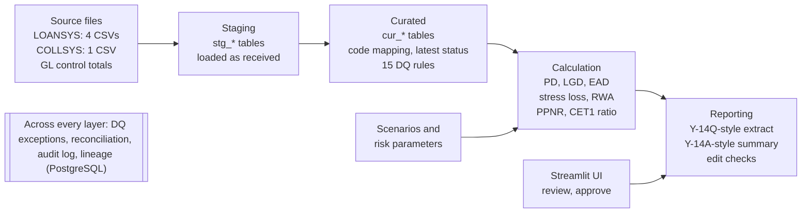
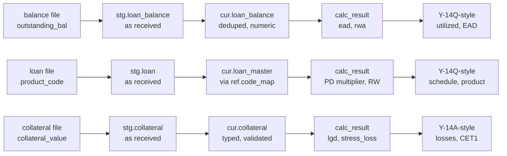

# CCAR POC — Product Requirements Document

Sep 26, 2026 · @Aditya Kumar

## 0. POC Options and Selection

Recommendation: build **Option A — a wholesale credit stress-loss pipeline with a light capital roll-forward**. It is the only option that touches every step of the lifecycle (source → DQ → calculation → reconciliation → report → approval → audit) in 4 sprints.

| # | Option | What it is | Business value | CCAR learning value | Technical complexity | Time to implement | Demo impact |
| --- | --- | --- | --- | --- | --- | --- | --- |
| A | **Wholesale Credit Stress-Loss Pipeline** (selected) | \~40 C&I and CRE loans flow from source files to a loan-level stress loss, RWA and CET1 impact, then to an FR Y-14Q-style extract with approval and audit | High — mirrors the most common Iris CCAR work: loan-level data sourcing, DQ, recon, reporting | High — PD/LGD/EAD, scenarios, RWA, PPNR, CET1, Y-14Q/A concepts, lineage | Medium — SQL + Python + simple UI | 4 two-week sprints | High — one story from raw data to a signed-off report |
| B | Retail Data Quality & Lineage Factory | Mortgage/card loan-level data prepared for an FR Y-14M-style extract; focus only on DQ rules, mapping and lineage; no risk calculations | Medium — strong for data-engineering roles | Medium — deep on data controls, shallow on risk and capital | Low–Medium | 2–3 sprints | Medium — controls are hard to make exciting |
| C | Top-Down Capital Projection Dashboard | Portfolio-level loss rates and PPNR drive a 9-quarter CET1 ratio projection in an FR Y-14A-style summary | Medium — good executive story | Medium — capital concepts, but no loan-level data work | Low | 2 sprints | High visually, but thin on BA/data skills |

**Why A wins:** B teaches controls but skips risk and capital. C looks good but skips the data work that dominates real CCAR delivery. A takes the loan-level core of B and a simplified version of C's capital layer, which gives the best balance for a short internal POC.

## 1. Executive Summary

**StressLens** is an 8-week internal Iris POC that runs 40 commercial loans for a fictional bank through a simplified CCAR lifecycle and produces an approved, auditable, FR Y-14-style report under three hypothetical stress scenarios.

- **Why:** Iris is about to enter CCAR delivery. Our BAs, developers, data engineers and QA have limited hands-on CCAR experience. A working POC closes that gap before client money is at stake.
- **What it does:** ingests loan, customer, collateral and status data; catches seeded data-quality defects; maps source codes to reporting codes; calculates PD, LGD, EAD, stress loss, RWA, PPNR and CET1 impact; reconciles source to target; produces a Y-14Q-style loan extract and a Y-14A-style capital summary; routes them through maker-checker approval with a full audit trail.
- **What it is not:** it is not a regulatory submission, not a validated model, and not built to Federal Reserve specifications. All formulas and scenarios are POC simplifications, labelled as such throughout.
- **Team and time:** one Scrum team (PO, BA, 2 developers, data engineer, QA, Scrum Master), 4 two-week sprints, open-source stack (PostgreSQL, Python, Streamlit).
- **Outcome for management:** a 20-minute live demo, a reusable CCAR starter kit (data model, DQ rule library, SQL pack, requirements and test templates), and a gap list for real client work.

**How to read this PRD**

| Label used in this document | Meaning |
| --- | --- |
| **\[CCAR\]** | A real CCAR / regulatory concept, described at a general level. Always verify details against current Federal Reserve rules and FR Y-14 instructions. |
| **\[POC\]** | A simplification made only for this POC. Not how a bank would do it in production. |
| **\[ASSUMPTION\]** | Something we assume so the team can proceed. Can be changed by the PO. |

## 2. POC Concept

**POC name:** StressLens — CCAR Wholesale Credit Stress Testing POC

**Fictional bank:** Iris Demo Bancorp (IDB), a hypothetical US bank holding company. \[ASSUMPTION\] All names, loans and figures are synthetic.

**Business problem.** \[CCAR\] Large US bank holding companies must show the Federal Reserve that they hold enough capital to keep lending through a severe recession. That depends on clean loan-level data, transparent loss calculations, reconciled numbers and a controlled sign-off. Most CCAR delivery pain is in the data: missing records, bad codes, duplicate rows, balances that don't tie to the general ledger, and weak lineage. Iris needs people who have already lived through these problems.

**Objective.** Build a small, working, end-to-end pipeline that gives every role on the team hands-on practice with CCAR data, calculations, controls and reporting, and that we can demo to management.

**Target users (personas inside the POC)**

| Persona | Real-world equivalent | Uses StressLens to |
| --- | --- | --- |
| Data Analyst (maker) | Regulatory reporting analyst | Load data, review DQ exceptions, run calculations, prepare the report |
| Risk Analyst | Credit risk / stress testing analyst | Choose scenarios, review PD/LGD/EAD and losses |
| Report Reviewer (checker) | Regulatory reporting manager | Review reconciliations and variances, approve or reject |
| Controller / Approver | Finance controller, CFO delegate | Final sign-off on the capital summary |
| Auditor | Internal audit / model risk | Read the audit trail and lineage |
| Admin | Platform support | Maintain reference data, scenarios and users |

**Key business outcomes**

1. Team can explain and demonstrate the CCAR data-to-report lifecycle.
2. Team has built and tested a reusable DQ rule library and reconciliation framework.
3. Team can read and write the SQL used daily on CCAR projects.
4. Management sees a credible, working proof of Iris CCAR capability.

**Success criteria**

| # | Criterion | Target |
| --- | --- | --- |
| 1 | End-to-end run from source files to approved report | One click / one command, < 5 minutes |
| 2 | Seeded data-quality defects detected | 100% of the 12 seeded defects |
| 3 | Source-to-target reconciliation | Loan count and balance tie out, or every break is explained |
| 4 | Calculation accuracy | Pipeline matches the QA spreadsheet within $1 per loan |
| 5 | Scenarios | 3 scenarios run and compared side by side |
| 6 | Approval and audit | Maker-checker enforced; every run, override and approval logged |
| 7 | Team learning | Every team member presents one part of the demo |
| 8 | Delivery | Demo delivered at end of Sprint 4 |

## 3. Scope / Out of Scope

The POC covers one portfolio (wholesale: C&I and CRE loans), one as-of date (Q2 2026 quarter-end, 2026-06-30), three hypothetical scenarios and a 9-quarter horizon collapsed into one cumulative figure.

| In scope | Out of scope |
| --- | --- |
| \~40 synthetic C&I and CRE loans, \~25 customers, \~30 collateral records | Real client or production data of any kind |
| CSV source files from 2 simulated source systems (LOANSYS, COLLSYS) | Live feeds, APIs, mainframe extracts, real-time processing |
| Staging, mapping, transformation into a curated layer | Enterprise data warehouse, data lake, Hadoop/Snowflake-scale design |
| 15 data-quality rules with exception logging and manual override | ML-based anomaly detection, DQ tooling (Collibra, Informatica DQ) |
| Rule-based PD, LGD, EAD, stress loss, RWA, PPNR, CET1 ratio | Statistical / econometric model development, model validation (SR 11-7) |
| 3 hypothetical scenarios: Baseline, Moderate, Severe | Actual Federal Reserve supervisory scenarios, bank-specific (BHC) scenarios |
| One cumulative 9-quarter loss and capital roll-forward | Quarter-by-quarter projections, balance-sheet growth, deferred tax, AOCI, market/operational risk |
| Simplified US standardized-approach risk weights | Advanced approaches, full Basel III / Basel III endgame rules |
| FR Y-14Q-style loan extract and FR Y-14A-style capital summary | Actual FR Y-14 schedules, XML/edit-check submission, Reporting Central |
| Source-to-target and GL-to-source reconciliation (GL is a single control-total file) | Full GL / FR Y-9C reconciliation |
| Maker-checker approval, audit log, lineage view | SSO, entitlements, SOX-grade controls, data retention policy |
| Streamlit UI for demo | Production UI, scalability, performance tuning, DR |

## 4. End-to-End Business Process

Nine steps take a quarter-end loan snapshot to an approved report; each step has a named owner, a control, and a gate that must pass before the next step starts.

**Flow:** Ingest → Map & Transform → Data Quality → Scenario Selection → Risk Calculation → Aggregation → Reconciliation → Report Generation → Review & Approval (audit trail captured at every step)

| # | Step | What happens | Who performs it | Data required | What is produced | Control / validation (gate) |
| --- | --- | --- | --- | --- | --- | --- |
| 1 | **Ingest source data** | Source CSVs for 2026-06-30 are loaded as-is into staging tables with a batch ID and load timestamp | Data Engineer (automated job) | LOANSYS files: customer, loan, balance, status; COLLSYS file: collateral; GL control-total file | `stg_*` tables, load log | File present; row count in file = row count loaded; file trailer count matches; as-of date = run date |
| 2 | **Map & transform** | Source codes mapped to standard codes (product, status, collateral type, industry); latest status picked; types converted | Automated; mapping tables owned by BA | `stg_*` tables, `ref_*` mapping tables | `cur_*` curated tables | Every source code has a mapping, else row goes to exceptions; no row silently dropped |
| 3 | **Data quality validation** | 15 DQ rules run (completeness, validity, uniqueness, accuracy, referential integrity) | Automated; exceptions reviewed by Data Analyst | `cur_*` tables, `dq_rule` | `dq_exception` records, DQ scorecard | Critical-rule failures block the run until fixed or overridden with a reason by a checker |
| 4 | **Select scenario(s)** | Risk Analyst picks one or more scenarios and confirms the parameters | Risk Analyst | `stress_scenario`, `risk_parameter` | `calc_run` record (status = STARTED) | Only ACTIVE, approved scenario versions can be used; parameters are locked for the run |
| 5 | **Risk calculation** | PD, LGD, EAD, stress loss and RWA calculated per loan per scenario | Automated (Python / SQL) | Curated loans, collateral, scenario, parameters | `calc_result` rows | PD, LGD in \[0,1\]; EAD ≥ 0; loss ≤ EAD; each loan has exactly one result per scenario |
| 6 | **Aggregate** | Loan results rolled up by portfolio, product and rating; PPNR and CET1 ratio projected | Automated | `calc_result`, bank-level inputs (starting CET1, other RWA, PPNR drivers) | `agg_result`, capital summary | Sum of loan losses = portfolio loss; Severe loss ≥ Moderate loss ≥ Baseline loss |
| 7 | **Reconcile** | Source vs staging vs curated vs report counts and balances; source balance vs GL control total | Automated; breaks explained by Data Analyst | All layers + GL control file | `recon_result`, break list | Breaks > tolerance ($1,000 or 0.01%) must have a comment before submission for review |
| 8 | **Generate report** | Y-14Q-style loan extract and Y-14A-style capital summary built; report-level edit checks run | Data Analyst (maker) | Curated + calc + agg tables | `reg_report` + `reg_report_line`, CSV/Excel export | Edit checks pass; report tied to one run ID and one scenario set |
| 9 | **Review & approve** | Checker reviews DQ, recon and variances, then approves or rejects with comments; Controller gives final sign-off | Report Reviewer, Controller | Report, recon results, DQ scorecard, prior-run comparison | Status APPROVED or REJECTED; locked report | Maker ≠ checker; approved reports are read-only; any rerun creates a new version |
| — | **Audit trail** (all steps) | Every load, rule run, override, calculation, approval and export is logged | System | All events | `audit_log`, lineage view | Log is append-only; each entry has user, timestamp, run ID, action, before/after values |

## 5. Architecture / Data Flow

StressLens is a four-layer batch pipeline in one PostgreSQL database, driven by Python and viewed through a Streamlit app; every layer writes to shared control tables.



Data only moves left to right; nothing downstream edits an upstream layer, so any number in the report can be traced back to a source row.

| Layer / component | Technology \[POC\] | Notes |
| --- | --- | --- |
| Source | CSV files in a `/landing/2026-06-30/` folder | Simulates LOANSYS (loan servicing) and COLLSYS (collateral) extracts, plus a GL control-total file |
| Database | PostgreSQL 16 (local Docker or a free cloud Postgres) | Schemas: `stg`, `ref`, `cur`, `calc`, `rpt`, `ctl` |
| Pipeline | Python 3.11 + pandas + SQL scripts; a single `run_pipeline.py --asof 2026-06-30` | Optional: dbt Core if the team wants lineage docs for free |
| DQ / recon | SQL rules stored as rows in `ctl.dq_rule`; executed by a Python runner | Rules are data, not code, so BAs can add them |
| UI | Streamlit | Pages: Run, DQ Exceptions, Results, Reconciliation, Report, Approvals, Audit |
| Reporting | Report tables + CSV/Excel export (openpyxl) | Optional Power BI view of the same tables |
| Tests | pytest + a QA expected-results spreadsheet | Calculation tests compare to hand-calculated values |
| Tooling | Git (Iris repo), Jira board, Confluence/this doc | Standard Iris Scrum tooling |

## 6. Data Model

The model has 9 business tables and 7 control/reference tables. Business tables live in the curated (`cur`), calculation (`calc`) and report (`rpt`) schemas; staging (`stg`) mirrors the source files column-for-column as text.

**Table summary**

| Table | Purpose | Primary key | Foreign keys |
| --- | --- | --- | --- |
| `cur.customer` | Obligor (borrower) master | customer\_id | — |
| `cur.loan_master` | Static loan terms | loan\_id | customer\_id → customer |
| `cur.loan_balance` | Quarter-end balances | loan\_id + as\_of\_date | loan\_id → loan\_master |
| `cur.loan_status_history` | Every status change per loan | status\_hist\_id | loan\_id → loan\_master |
| `cur.collateral` | Collateral pledged against loans | collateral\_id | loan\_id → loan\_master |
| `ref.stress_scenario` | Scenario variables and multipliers | scenario\_id + version | — |
| `ref.risk_parameter` | Base PD, LGD, CCF, risk weights | param\_id | — |
| `calc.calc_result` | Loan-level results per scenario | run\_id + loan\_id + scenario\_id | run\_id → calc\_run; loan\_id → loan\_master; scenario\_id → stress\_scenario |
| `rpt.reg_report` / `rpt.reg_report_line` | Report header and lines | report\_id / report\_id + line\_no | run\_id → calc\_run; report\_id → reg\_report |
| `ref.code_map` | Source code → standard code | source\_system + code\_type + source\_code | — |
| `ctl.calc_run` | One row per pipeline run | run\_id | — |
| `ctl.dq_rule` / `ctl.dq_exception` | DQ rule library and failures | rule\_id / exception\_id | exception.rule\_id → dq\_rule; run\_id → calc\_run |
| `ctl.recon_result` | Reconciliation checks and breaks | recon\_id | run\_id → calc\_run |
| `ctl.gl_control` | GL control totals by product | gl\_account + as\_of\_date | — |
| `ctl.audit_log` | Append-only event log | audit\_id | run\_id → calc\_run |

### 6.1 Customer (`cur.customer`)

One row per borrower. PK: customer\_id.

| Field | Description | Data type | Example |
| --- | --- | --- | --- |
| customer\_id | Unique obligor ID from LOANSYS | VARCHAR(10) | C0007 |
| customer\_name | Legal name (synthetic) | VARCHAR(100) | Lakeside Precision Tooling LLC |
| naics\_code | Industry classification (NAICS) | CHAR(6) | 332710 |
| industry\_segment | Mapped industry group | VARCHAR(40) | Manufacturing |
| state\_code | US state of headquarters | CHAR(2) | OH |
| obligor\_rating | Internal risk rating, 1 (best) to 10 (default) | SMALLINT | 5 |
| customer\_since | Relationship start date | DATE | 2014-03-01 |

### 6.2 Loan Master (`cur.loan_master`)

Static terms, one row per facility. PK: loan\_id. FK: customer\_id.

| Field | Description | Data type | Example |
| --- | --- | --- | --- |
| loan\_id | Facility ID | VARCHAR(10) | LN1012 |
| customer\_id | Borrower | VARCHAR(10) | C0007 |
| src\_product\_code | Product code as received | VARCHAR(10) | CIT |
| product\_code | Standard product (after mapping) | VARCHAR(20) | CI\_TERM |
| portfolio | C&I or CRE | VARCHAR(5) | CI |
| origination\_date | Booking date | DATE | 2022-05-16 |
| maturity\_date | Contractual maturity | DATE | 2029-05-16 |
| commitment\_amt | Total committed limit (USD) | NUMERIC(18,2) | 8,000,000.00 |
| interest\_rate | Current rate (decimal) | NUMERIC(7,5) | 0.07250 |
| rate\_type | FIXED or FLOAT | VARCHAR(5) | FLOAT |
| hvcre\_flag | High-volatility CRE (Y/N) | CHAR(1) | N |
| source\_system | Originating system | VARCHAR(10) | LOANSYS |

### 6.3 Loan Balance (`cur.loan_balance`)

Quarter-end snapshot. PK: loan\_id + as\_of\_date. FK: loan\_id.

| Field | Description | Data type | Example |
| --- | --- | --- | --- |
| loan\_id | Facility ID | VARCHAR(10) | LN1012 |
| as\_of\_date | Snapshot date | DATE | 2026-06-30 |
| outstanding\_bal | Drawn principal (USD) | NUMERIC(18,2) | 6,250,000.00 |
| undrawn\_amt | commitment\_amt − outstanding\_bal | NUMERIC(18,2) | 1,750,000.00 |
| days\_past\_due | Days past due at snapshot | INTEGER | 0 |
| gl\_account | GL account the balance posts to | VARCHAR(10) | 141000 |

### 6.4 Loan Status History (`cur.loan_status_history`)

Every status change. PK: status\_hist\_id. FK: loan\_id. Current status = latest effective\_date on or before as-of date.

| Field | Description | Data type | Example |
| --- | --- | --- | --- |
| status\_hist\_id | Surrogate key | BIGINT | 50031 |
| loan\_id | Facility ID | VARCHAR(10) | LN1030 |
| src\_status\_code | Status as received | VARCHAR(5) | 90 |
| status\_code | Standard status: CURRENT, DPD30, DPD60, DPD90, NONACCRUAL, PAIDOFF | VARCHAR(12) | DPD90 |
| effective\_date | Date status took effect | DATE | 2026-06-12 |
| load\_ts | When the row was received | TIMESTAMP | 2026-07-02 06:10:00 |

### 6.5 Collateral (`cur.collateral`)

PK: collateral\_id. FK: loan\_id (one loan can have zero or more collateral items).

| Field | Description | Data type | Example |
| --- | --- | --- | --- |
| collateral\_id | Collateral ID from COLLSYS | VARCHAR(10) | CL2005 |
| loan\_id | Secured loan | VARCHAR(10) | LN1023 |
| src\_collateral\_type | Type as received | VARCHAR(10) | OFF |
| collateral\_type | Standard: CRE\_OFFICE, CRE\_MF, CRE\_RETAIL, CRE\_IND, EQUIPMENT, AR\_INV | VARCHAR(12) | CRE\_OFFICE |
| collateral\_value | Latest appraised value (USD) | NUMERIC(18,2) | 14,500,000.00 |
| valuation\_date | Appraisal date | DATE | 2025-11-20 |

### 6.6 Stress Scenario (`ref.stress_scenario`)

PK: scenario\_id + version. See Section 10 for values.

| Field | Description | Data type | Example |
| --- | --- | --- | --- |
| scenario\_id | BASE, MOD, SEV | VARCHAR(5) | SEV |
| version | Parameter version | SMALLINT | 1 |
| scenario\_name | Display name | VARCHAR(40) | Severe Stress |
| unemployment\_peak | Peak unemployment rate (%) | NUMERIC(5,2) | 10.00 |
| gdp\_peak\_to\_trough | Real GDP change (%) | NUMERIC(5,2) | -4.00 |
| cre\_price\_change | CRE price change (%) | NUMERIC(5,2) | -40.00 |
| pd\_multiplier\_ci / pd\_multiplier\_cre | PD stress multipliers | NUMERIC(5,2) | 3.00 / 3.50 |
| other\_coll\_haircut | Extra haircut on non-CRE collateral | NUMERIC(5,4) | 0.3000 |
| ppnr\_factor | PPNR scaling vs baseline | NUMERIC(5,2) | 0.60 |
| status | DRAFT, ACTIVE, RETIRED | VARCHAR(8) | ACTIVE |
| approved\_by | Approver user ID | VARCHAR(30) | risk.lead |

### 6.7 Risk Parameters (`ref.risk_parameter`)

PK: param\_id. Key-value table so BAs can change parameters without code changes.

| Field | Description | Data type | Example |
| --- | --- | --- | --- |
| param\_id | Surrogate key | INTEGER | 12 |
| param\_type | BASE\_PD, LGD\_FLOOR, UNSECURED\_LGD, CCF, RISK\_WEIGHT, RECOVERY\_COST | VARCHAR(20) | BASE\_PD |
| param\_key | Rating, product or collateral type | VARCHAR(20) | 5 |
| param\_value | Value (decimal) | NUMERIC(9,6) | 0.020000 |
| effective\_from | Start date | DATE | 2026-01-01 |
| version | Version | SMALLINT | 1 |

### 6.8 Calculation Results (`calc.calc_result`)

PK: run\_id + loan\_id + scenario\_id.

| Field | Description | Data type | Example |
| --- | --- | --- | --- |
| run\_id | Pipeline run | VARCHAR(20) | R20260630-003 |
| loan\_id | Facility | VARCHAR(10) | LN1012 |
| scenario\_id | Scenario | VARCHAR(5) | SEV |
| base\_pd | Annual PD before stress | NUMERIC(9,6) | 0.020000 |
| stressed\_pd | Annual PD after multiplier (cap 1) | NUMERIC(9,6) | 0.060000 |
| cum\_pd\_9q | 9-quarter cumulative PD | NUMERIC(9,6) | 0.135000 |
| ead | Exposure at default (USD) | NUMERIC(18,2) | 7,125,000.00 |
| lgd | Loss given default | NUMERIC(9,6) | 0.450000 |
| stress\_loss | cum\_pd × lgd × ead (USD) | NUMERIC(18,2) | 432,843.75 |
| risk\_weight | Applied risk weight | NUMERIC(5,2) | 1.00 |
| rwa | Risk-weighted assets (USD) | NUMERIC(18,2) | 7,125,000.00 |

### 6.9 Regulatory Report (`rpt.reg_report` + `rpt.reg_report_line`)

Header PK: report\_id. Line PK: report\_id + line\_no. FK: run\_id.

| Field | Description | Data type | Example |
| --- | --- | --- | --- |
| report\_id | Report instance | VARCHAR(30) | RPT-Y14Q-CORP-20260630-v2 |
| run\_id | Run that produced it | VARCHAR(20) | R20260630-003 |
| report\_type | Y14Q\_STYLE\_CORP, Y14Q\_STYLE\_CRE, Y14A\_STYLE\_CAPITAL | VARCHAR(25) | Y14Q\_STYLE\_CORP |
| version | Increments on every regeneration | SMALLINT | 2 |
| status | DRAFT, IN\_REVIEW, APPROVED, REJECTED | VARCHAR(10) | IN\_REVIEW |
| prepared\_by / reviewed\_by / approved\_by | Maker, checker, final approver | VARCHAR(30) | analyst1 / reviewer1 / controller1 |
| line\_no, field\_code, field\_value | One reported value per line (long format) | INT, VARCHAR(40), VARCHAR(100) | 14, OUTSTANDING\_BAL, 6250000.00 |
| loan\_id | Loan the line belongs to (null for summary lines) | VARCHAR(10) | LN1012 |
| lineage\_ref | Source table.field the value came from | VARCHAR(100) | cur.loan\_balance.outstanding\_bal |

## 7. Sample Data

The dataset is 25 customers, 40 loans ($286.6M outstanding once cleaned), 24 collateral items and 51 status records as of 2026-06-30, with 12 deliberately seeded defects. All data is synthetic. \[POC\]

### 7.1 Seeded data-quality defects

| # | Defect type | Where | What is wrong | How to detect | How to resolve (POC decision) |
| --- | --- | --- | --- | --- | --- |
| D01 | NULL value (critical) | LN1018 `interest_rate` | Rate missing | Completeness rule: `interest_rate IS NULL` | Request correction from LOANSYS; corrected file gives 0.0695 |
| D02 | NULL value (critical) | C0019 `obligor_rating` (drives LN1021) | No rating, so no PD | Completeness rule on rating | Checker-approved override to rating 7 (conservative), logged in audit |
| D03 | NULL value (warning) | C0014 `naics_code` | Industry missing | Completeness rule, warning severity | Flag only; industry shown as UNKNOWN in the report |
| D04 | Duplicate record | LN1025 balance row appears twice | Balance double-counted (+$3.9M) | Uniqueness rule: `GROUP BY loan_id, as_of_date HAVING COUNT(*) > 1` | Keep one row; log removed row |
| D05 | Missing record | LN1033 has no balance row | Loan silently disappears from results | Anti-join loan\_master → loan\_balance | Supplementary file from LOANSYS gives $8.7M |
| D06 | Missing parent (orphan) | LN1041 in balance file, not in loan master | $2.4M balance with no loan terms | Anti-join loan\_balance → loan\_master | Excluded from run; recorded as explained GL break (loan booked after master extract cut-off) |
| D07 | Referential integrity | LN1038 points to customer C0026, not in customer file | No rating, no industry | FK check loan\_master → customer | Supplementary customer record added (rating 6) |
| D08 | Invalid status | LN1029 status code `XX` | Code not in mapping table | Validity rule: code not in `ref.code_map` | Source confirms 60 days past due (matches `days_past_due` = 64) |
| D09 | Incorrect mapping | `ref.code_map`: PRODUCT `CRM` → `CI_TERM` | 5 multifamily loans ($67.55M) land in the C&I extract | Cross-field rule: C&I product with CRE collateral | Fix mapping to `CRE_MULTIFAMILY` (mapping change goes through approval) |
| D10 | Incorrect balance | LN1021 balance is −$2,250,000; LN1010 balance $4.35M > commitment $4.0M | Negative balance; over-limit | Accuracy rules: balance < 0; balance > commitment | LN1021: sign error, corrected to +$2.25M. LN1010: commitment amendment to $4.5M not loaded; master corrected |
| D11 | Multiple status records | LN1030 has 3 records (30 → 60 → 90); LN1015 has 2 records with the same effective date | Wrong status if the wrong row is chosen | Latest-status query; tie check on effective date | LN1030 = DPD90 (defaulted). LN1015: latest `load_ts` wins → CURRENT (cured) |
| D12 | Stale data (warning) | CL2006 appraisal dated 2023-02-10 (> 24 months) | Collateral value may be overstated | Timeliness rule on `valuation_date` | Warning; flagged for re-appraisal, value used as-is |

**Impact of the defects on the numbers:** the raw balance file has 41 rows totalling $279.7M; after fixes the curated layer holds 40 loans totalling $286.6M, and the GL shows $289.0M. Section 17 walks through that bridge.

### 7.2 Customer file (`loansys_customer.csv`)

```csv
customer_id,customer_name,naics_code,state_code,obligor_rating,customer_since
C0001,Blue Ridge Logistics Inc,484121,VA,4,2012-04-02
C0002,Canyon Foods Distribution LLC,424410,AZ,5,2015-09-14
C0003,Harborview Office Partners LP,531120,MA,4,2016-01-20
C0004,Prairie Ag Equipment Co,423820,KS,6,2011-06-30
C0005,Summit Medical Devices Inc,339112,MN,3,2018-03-05
C0006,Riverbend Apartments LLC,531110,TX,4,2017-07-11
C0007,Lakeside Precision Tooling LLC,332710,OH,5,2014-03-01
C0008,Golden Gate Retail Center LP,531120,CA,6,2013-10-22
C0009,Keystone Building Supply Inc,444110,PA,5,2019-02-18
C0010,Metro Industrial Park LLC,531130,IL,3,2016-08-09
C0011,Coastal Seafood Processors Inc,311710,ME,7,2010-05-17
C0012,Pinecrest Senior Living LLC,531110,NC,5,2020-01-06
C0013,Ironclad Security Services Inc,561612,GA,4,2018-11-13
C0014,Northstar Software Solutions Inc,,WA,3,2021-04-26
C0015,Desert Sun Hospitality Group LLC,721110,NV,7,2015-12-01
C0016,Great Lakes Plastics Corp,326199,MI,6,2012-09-24
C0017,Midtown Office Tower LLC,531120,NY,5,2014-06-16
C0018,Sunbelt Distribution Center LP,531130,FL,4,2019-05-07
C0019,Heritage Furniture Makers Inc,337122,NC,,2011-02-14
C0020,Bayou Energy Services LLC,213112,LA,8,2013-08-19
C0021,Oakwood Garden Apartments LP,531110,GA,4,2018-10-03
C0022,Frontier Trucking Co,484121,NE,6,2017-03-27
C0023,Crescent Plaza Shopping Center LLC,531120,LA,7,2012-12-10
C0024,Evergreen Pharma Packaging Inc,325412,NJ,3,2020-07-15
C0025,Silverline Auto Parts Inc,441310,TN,5,2016-05-23
```

Supplementary record (resolves D07): `C0026,Redwood Craft Brewing Co,312120,OR,6,2022-02-01`

### 7.3 Loan file (`loansys_loan.csv`)

Source product codes: CIT = C&I term, CIR = C&I revolver, CRO = CRE office, CRM = CRE multifamily, CRR = CRE retail, CRI = CRE industrial.

```csv
loan_id,customer_id,product_code,orig_date,maturity_date,commitment_amt,interest_rate,rate_type,hvcre_flag
LN1001,C0001,CIT,2021-03-15,2028-03-15,6000000,0.0685,FLOAT,N
LN1002,C0001,CIR,2023-01-10,2027-01-10,4000000,0.074,FLOAT,N
LN1003,C0002,CIR,2022-06-01,2027-06-01,5000000,0.076,FLOAT,N
LN1004,C0003,CRO,2019-09-30,2029-09-30,18000000,0.0525,FIXED,N
LN1005,C0004,CIT,2020-11-20,2027-11-20,3500000,0.071,FIXED,N
LN1006,C0005,CIR,2024-02-12,2029-02-12,7500000,0.069,FLOAT,N
LN1007,C0006,CRM,2018-05-01,2028-05-01,22000000,0.0475,FIXED,N
LN1008,C0007,CIR,2021-08-18,2026-12-18,3000000,0.0775,FLOAT,N
LN1009,C0008,CRR,2017-04-11,2027-04-11,15000000,0.056,FIXED,N
LN1010,C0009,CIR,2022-10-05,2027-10-05,4000000,0.075,FLOAT,N
LN1011,C0010,CRI,2020-02-28,2030-02-28,20000000,0.051,FIXED,N
LN1012,C0007,CIT,2022-05-16,2029-05-16,8000000,0.0725,FLOAT,N
LN1013,C0011,CIT,2019-07-22,2026-07-22,2500000,0.081,FIXED,N
LN1014,C0012,CRM,2021-12-15,2031-12-15,16000000,0.054,FIXED,N
LN1015,C0013,CIR,2023-04-03,2028-04-03,3000000,0.073,FLOAT,N
LN1016,C0014,CIT,2024-06-28,2029-06-28,9000000,0.0665,FLOAT,N
LN1017,C0015,CRR,2016-03-18,2026-09-18,12000000,0.061,FIXED,N
LN1018,C0016,CIT,2020-09-09,2027-09-09,5500000,,FIXED,N
LN1019,C0017,CRO,2018-11-01,2028-11-01,30000000,0.049,FIXED,N
LN1020,C0018,CRI,2021-06-14,2031-06-14,14000000,0.053,FIXED,N
LN1021,C0019,CIT,2019-01-25,2027-01-25,4500000,0.07,FIXED,N
LN1022,C0020,CIR,2022-03-30,2027-03-30,6000000,0.085,FLOAT,N
LN1023,C0017,CRO,2025-01-15,2028-01-15,10000000,0.079,FLOAT,Y
LN1024,C0021,CRM,2019-08-20,2029-08-20,12500000,0.046,FIXED,N
LN1025,C0022,CIT,2021-10-12,2028-10-12,5000000,0.0715,FIXED,N
LN1026,C0023,CRR,2015-07-07,2027-07-07,9500000,0.059,FIXED,N
LN1027,C0024,CIR,2023-09-19,2028-09-19,6500000,0.068,FLOAT,N
LN1028,C0025,CIT,2020-04-01,2027-04-01,3800000,0.0705,FIXED,N
LN1029,C0002,CIT,2021-12-01,2028-12-01,4200000,0.072,FIXED,N
LN1030,C0011,CIR,2022-07-15,2027-07-15,2000000,0.083,FLOAT,N
LN1031,C0003,CRO,2022-11-30,2032-11-30,11000000,0.058,FIXED,N
LN1032,C0005,CIT,2023-05-22,2030-05-22,7000000,0.067,FLOAT,N
LN1033,C0010,CRI,2024-08-08,2034-08-08,9000000,0.062,FIXED,N
LN1034,C0013,CIT,2022-01-18,2027-01-18,2800000,0.0735,FIXED,N
LN1035,C0015,CIR,2023-02-27,2027-02-27,3500000,0.082,FLOAT,N
LN1036,C0012,CRM,2024-10-01,2034-10-01,13000000,0.06,FIXED,N
LN1037,C0022,CIR,2024-03-11,2028-03-11,2500000,0.076,FLOAT,N
LN1038,C0026,CIT,2025-02-03,2030-02-03,3200000,0.0745,FLOAT,N
LN1039,C0024,CIT,2021-06-25,2028-06-25,5200000,0.0655,FIXED,N
LN1040,C0021,CRM,2025-04-30,2035-04-30,8500000,0.063,FIXED,N
```

### 7.4 Balance file (`loansys_balance.csv`)

Note the duplicate LN1025, the negative LN1021, the missing LN1033 and the orphan LN1041.

```csv
loan_id,as_of_date,outstanding_bal,days_past_due,gl_account
LN1001,2026-06-30,4200000,0,141000
LN1002,2026-06-30,2600000,0,141000
LN1003,2026-06-30,3100000,0,141000
LN1004,2026-06-30,16200000,0,142000
LN1005,2026-06-30,2150000,0,141000
LN1006,2026-06-30,3900000,0,141000
LN1007,2026-06-30,19800000,0,142000
LN1008,2026-06-30,2750000,0,141000
LN1009,2026-06-30,13100000,0,142000
LN1010,2026-06-30,4350000,0,141000
LN1011,2026-06-30,18300000,0,142000
LN1012,2026-06-30,6250000,0,141000
LN1013,2026-06-30,650000,35,141000
LN1014,2026-06-30,15400000,0,142000
LN1015,2026-06-30,1800000,0,141000
LN1016,2026-06-30,8600000,0,141000
LN1017,2026-06-30,11200000,0,142000
LN1018,2026-06-30,3300000,0,141000
LN1019,2026-06-30,27500000,0,142000
LN1020,2026-06-30,13300000,0,142000
LN1021,2026-06-30,-2250000,0,141000
LN1022,2026-06-30,5400000,62,141000
LN1023,2026-06-30,7800000,0,142000
LN1024,2026-06-30,11100000,0,142000
LN1025,2026-06-30,3900000,0,141000
LN1025,2026-06-30,3900000,0,141000
LN1026,2026-06-30,8800000,0,142000
LN1027,2026-06-30,2200000,0,141000
LN1028,2026-06-30,1900000,0,141000
LN1029,2026-06-30,3600000,64,141000
LN1030,2026-06-30,1950000,95,141000
LN1031,2026-06-30,10600000,0,142000
LN1032,2026-06-30,6400000,0,141000
LN1034,2026-06-30,1500000,0,141000
LN1035,2026-06-30,3100000,31,141000
LN1036,2026-06-30,12800000,0,142000
LN1037,2026-06-30,900000,0,141000
LN1038,2026-06-30,3000000,0,141000
LN1039,2026-06-30,3800000,0,141000
LN1040,2026-06-30,8450000,0,142000
LN1041,2026-06-30,2400000,0,141000
```

### 7.5 Status history file (`loansys_status.csv`)

Rows 50001–50040 give every loan an initial status `C` (current) effective on its origination date. The rows below are the later changes.

```csv
status_hist_id,loan_id,status_code,effective_date,load_ts
50041,LN1013,30,2026-06-05,2026-06-06 06:00:00
50042,LN1022,30,2026-05-01,2026-05-02 06:00:00
50043,LN1022,60,2026-05-31,2026-06-01 06:00:00
50044,LN1029,XX,2026-05-28,2026-05-29 06:00:00
50045,LN1030,30,2026-04-20,2026-04-21 06:00:00
50046,LN1030,60,2026-05-20,2026-05-21 06:00:00
50047,LN1030,90,2026-06-19,2026-06-20 06:00:00
50048,LN1035,30,2026-05-30,2026-05-31 06:00:00
50049,LN1015,30,2026-06-15,2026-06-16 06:00:00
50050,LN1015,C,2026-06-15,2026-06-16 14:30:00
50051,LN1017,NA,2026-03-31,2026-04-01 06:00:00
```

### 7.6 Collateral file (`collsys_collateral.csv`)

Source types: OFF office, MFR multifamily, RTL retail, IND industrial, EQP equipment, ARI receivables and inventory. Loans without collateral are unsecured.

```csv
collateral_id,loan_id,collateral_type,collateral_value,valuation_date
CL2001,LN1001,EQP,3000000,2025-09-30
CL2002,LN1003,ARI,2500000,2026-03-31
CL2003,LN1004,OFF,25000000,2025-06-15
CL2004,LN1005,EQP,1800000,2025-12-31
CL2005,LN1007,MFR,33000000,2025-10-01
CL2006,LN1009,RTL,19000000,2023-02-10
CL2007,LN1011,IND,30500000,2025-08-20
CL2008,LN1014,MFR,22000000,2025-12-05
CL2009,LN1017,RTL,12500000,2026-01-15
CL2010,LN1019,OFF,36000000,2025-11-20
CL2011,LN1020,IND,21000000,2026-02-28
CL2012,LN1022,EQP,3500000,2025-07-31
CL2013,LN1023,OFF,11500000,2025-01-05
CL2014,LN1024,MFR,17500000,2025-09-09
CL2015,LN1025,EQP,2800000,2025-11-30
CL2016,LN1026,RTL,11000000,2025-05-19
CL2017,LN1028,EQP,1200000,2026-01-31
CL2018,LN1030,ARI,1000000,2026-03-31
CL2019,LN1031,OFF,16000000,2024-11-30
CL2020,LN1033,IND,13500000,2024-07-25
CL2021,LN1036,MFR,18500000,2024-09-15
CL2022,LN1040,MFR,12000000,2025-04-10
CL2023,LN1037,ARI,1500000,2026-03-31
CL2024,LN1011,IND,2000000,2025-08-20
```

### 7.7 GL control totals (`gl_control.csv`)

```csv
gl_account,as_of_date,gl_balance
141000,2026-06-30,85950000
142000,2026-06-30,203050000
```

GL 141000 = C&I loans, 142000 = CRE loans. \[POC\] A real bank would reconcile to many GL accounts and to the FR Y-9C.

## 8. Data Mapping & Lineage

Sixteen target fields drive every number in the report; each has one documented source, rule and transformation, stored in a `ref.field_mapping` table so lineage can be queried, not just drawn.

| # | Source table | Source field | Business rule | Transformation | Target table | Target field |
| --- | --- | --- | --- | --- | --- | --- |
| M01 | loansys\_customer | customer\_id | Must be unique and not null | TRIM, UPPER | cur.customer | customer\_id |
| M02 | loansys\_customer | obligor\_rating | Integer 1–10; null is a critical exception | CAST to SMALLINT; approved override if null | cur.customer | obligor\_rating |
| M03 | loansys\_customer | naics\_code | 6 digits; null allowed with warning | First 2 digits → sector via `ref.code_map` (NAICS2); null → UNKNOWN | cur.customer | industry\_segment |
| M04 | loansys\_loan | product\_code | Every code must exist in the mapping | Lookup `ref.code_map` (PRODUCT) | cur.loan\_master | product\_code |
| M05 | loansys\_loan | product\_code | Derived | `CASE WHEN product_code LIKE 'CRE%' THEN 'CRE' ELSE 'CI' END` | cur.loan\_master | portfolio |
| M06 | loansys\_loan | commitment\_amt | > 0 | CAST NUMERIC(18,2) | cur.loan\_master | commitment\_amt |
| M07 | loansys\_loan | interest\_rate | 0 < rate < 0.25; not null | CAST NUMERIC(7,5) | cur.loan\_master | interest\_rate |
| M08 | loansys\_loan | hvcre\_flag | Y or N; CRE products only | UPPER; default N | cur.loan\_master | hvcre\_flag |
| M09 | loansys\_balance | outstanding\_bal | One row per loan per as-of date; ≥ 0; ≤ commitment | CAST; de-duplicate on (loan\_id, as\_of\_date) | cur.loan\_balance | outstanding\_bal |
| M10 | loansys\_balance + loansys\_loan | outstanding\_bal, commitment\_amt | Derived | `GREATEST(commitment_amt - outstanding_bal, 0)` | cur.loan\_balance | undrawn\_amt |
| M11 | loansys\_status | status\_code, effective\_date, load\_ts | Latest effective\_date ≤ as-of; tie → latest load\_ts | ROW\_NUMBER() window; lookup `ref.code_map` (STATUS) | cur.loan\_master (view `v_loan_current_status`) | current\_status |
| M12 | collsys\_collateral | collateral\_type | Every code must exist in mapping | Lookup `ref.code_map` (COLLATERAL) | cur.collateral | collateral\_type |
| M13 | collsys\_collateral | collateral\_value, valuation\_date | > 0; valuation ≤ 24 months old (warning) | CAST; age = as-of − valuation\_date | cur.collateral | collateral\_value, valuation\_age\_months |
| M14 | cur.loan\_balance | outstanding\_bal, undrawn\_amt | Derived | `outstanding_bal + 0.50 × undrawn_amt` | calc.calc\_result | ead |
| M15 | cur.\* + calc.calc\_result | commitment\_amt, outstanding\_bal, obligor\_rating, stress\_loss | Report only curated/calculated values | Pivot to report lines; stamp `lineage_ref` | rpt.reg\_report\_line | Y-14Q-style fields (Section 11) |
| M16 | calc.calc\_result | stress\_loss | Sum by scenario | `SUM(stress_loss)` GROUP BY scenario\_id | rpt.reg\_report\_line | Y-14A-style credit losses |

**Mapping table (`ref.code_map`)**

| code\_type | source\_code | target\_code |
| --- | --- | --- |
| PRODUCT | CIT | CI\_TERM |
| PRODUCT | CIR | CI\_REVOLVER |
| PRODUCT | CRO | CRE\_OFFICE |
| PRODUCT | CRM | CI\_TERM ← seeded defect D09; correct value CRE\_MULTIFAMILY |
| PRODUCT | CRR | CRE\_RETAIL |
| PRODUCT | CRI | CRE\_INDUSTRIAL |
| STATUS | C / 30 / 60 / 90 / NA / PO | CURRENT / DPD30 / DPD60 / DPD90 / NONACCRUAL / PAIDOFF |
| COLLATERAL | OFF / MFR / RTL / IND / EQP / ARI | CRE\_OFFICE / CRE\_MF / CRE\_RETAIL / CRE\_IND / EQUIPMENT / AR\_INV |

### Lineage diagram



Each report line stores a `lineage_ref` and the run ID, so an auditor can click a reported value and walk back to the source file row. \[CCAR\] Field-level lineage from report back to source is a common expectation in CCAR data governance reviews; the POC shows the idea on a small scale.

## 9. CCAR Calculations

Under the Severe scenario the 40-loan book loses $24.2M (7.7% of EAD) over 9 quarters and IDB's CET1 ratio falls from 11.99% to 8.53%, still above the 4.5% minimum. Every formula below is a \[POC\] simplification chosen so a BA can check it in Excel.

**What is real vs simplified**

| Concept | \[CCAR\] In practice | \[POC\] In StressLens |
| --- | --- | --- |
| PD | Statistical models linking default rates to macro variables, by segment, per quarter | Lookup by internal rating × scenario multiplier |
| LGD | Models using collateral, seniority, workout history; downturn LGD | Stressed collateral value vs EAD, with a floor and a cap |
| EAD | Credit conversion factors by product and utilization behaviour | Drawn + 50% of undrawn |
| Losses | Quarterly projections over 9 quarters, plus allowance (ACL / CECL) build | One cumulative 9-quarter loss; provisions = losses |
| RWA | Full standardized approach, projected every quarter | Simplified standardized risk weights, held flat |
| PPNR | Revenue and expense models by business line | Loan NII + fixed fee income and expense, scaled by scenario |
| Capital | Quarterly CET1 path, minimum ratio over horizon, SCB calculation | End-of-horizon CET1 ratio; illustrative SCB |

### 9.1 Parameters (`ref.risk_parameter`, version 1)

| Parameter | Value | Label |
| --- | --- | --- |
| Base annual PD by rating 1–10 | 0.05%, 0.10%, 0.30%, 0.80%, 2.00%, 4.00%, 8.00%, 15.00%, 30.00%, 100% | \[POC\] |
| PD for DPD30 / DPD60 loans | max(rating PD, 15%) | \[POC\] |
| PD for DPD90 / NONACCRUAL loans | 100% (treated as defaulted) | \[POC\], consistent with the common 90-days-past-due default definition |
| Horizon factor (annual → 9-quarter) | 2.25 | \[POC\] linear; a model would use 1 − (1 − PD)^2.25 or quarterly PDs |
| Credit conversion factor (CCF) | 50% on all undrawn amounts | \[POC\]; \[CCAR\] US standardized approach uses 50% for commitments over one year, 20% for one year or less |
| Unsecured LGD | 45% | \[POC\]; same figure as the Basel foundation-IRB senior unsecured LGD |
| LGD floor / cap for secured loans | 10% / 45% | \[POC\] |
| Recovery (liquidation) cost | 10% of stressed collateral value | \[POC\] |
| Risk weight: C&I, non-HVCRE CRE | 100% | \[CCAR\] US standardized approach, simplified |
| Risk weight: HVCRE, or 90+ DPD / nonaccrual | 150% | \[CCAR\] US standardized approach, simplified |
| Tax rate | 21% | \[ASSUMPTION\] US federal statutory rate; no state tax or deferred tax |

### 9.2 PD (Probability of Default)

```latex
PD_{stressed} = \min(1,\; PD_{base} \times M_{scenario,portfolio})
```

```latex
PD_{9Q} = \min(1,\; PD_{stressed} \times 2.25)
```

M is the scenario multiplier for C&I or CRE (Section 10). Defaulted loans (PD = 100%) are not multiplied.

### 9.3 EAD (Exposure at Default)

```latex
EAD = Outstanding + CCF \times \max(0,\; Commitment - Outstanding)
```

### 9.4 LGD (Loss Given Default)

```latex
Collateral_{stressed} = \sum_{items} Value \times (1 + \Delta CRE\ price) \;\text{(CRE types)} \;\text{or}\; Value \times (1 - haircut) \;\text{(equipment, receivables)}
```

```latex
LGD_{secured} = \min\left(45\%,\; \max\left(10\%,\; 1 - \frac{Collateral_{stressed} \times (1 - 10\%)}{EAD}\right)\right)
```

Unsecured loans use LGD = 45%. The 45% cap stops a secured loan from looking worse than an unsecured one. \[POC\]

### 9.5 Stress loss (expected loss under stress)

```latex
Stress\ Loss_{9Q} = PD_{9Q} \times LGD \times EAD
```

&#91;CCAR\] In real CCAR this feeds provisions, which also include changes in the allowance for credit losses. \[POC\] Provisions = stress loss.

### 9.6 RWA (Risk-Weighted Assets)

```latex
RWA_{loan} = EAD \times RiskWeight
```

```latex
RWA_{total} = \sum RWA_{loan} + Other\ RWA\ (\$180M,\ fixed)
```

&#91;ASSUMPTION\] Other RWA represents IDB's securities, cash and other assets. RWA is held flat across the horizon.

### 9.7 PPNR (Pre-Provision Net Revenue)

```latex
PPNR_{quarter} = \underbrace{\tfrac{1}{4}\sum (Outstanding \times Rate) - \tfrac{1}{4}(Total\ Outstanding \times 3.0\%)}_{Net\ interest\ income} + Noninterest\ Income - Noninterest\ Expense
```

```latex
PPNR_{9Q,scenario} = 9 \times PPNR_{quarter} \times PPNR\ factor_{scenario}
```

| PPNR input \[ASSUMPTION\] | Quarterly value |
| --- | --- |
| Loan interest income | $4,293,725 |
| Funding cost (3.0% on $286.6M) | $2,149,500 |
| Net interest income | $2,144,225 |
| Noninterest income | $1,200,000 |
| Noninterest expense | $1,900,000 |
| PPNR (baseline) | $1,444,225 |

### 9.8 Capital impact

```latex
Net\ Income = (PPNR_{9Q} - Stress\ Loss_{9Q}) \times (1 - 21\%)
```

```latex
CET1_{end} = CET1_{start} + Net\ Income - Dividends_{9Q}
```

```latex
CET1\ Ratio_{end} = CET1_{end} / RWA_{total}
```

Starting position \[ASSUMPTION\]: CET1 $60.4M, RWA $503.64M (loans $323.64M + other $180M), CET1 ratio 11.99%, dividends $0.5M per quarter ($4.5M over 9 quarters).

&#91;CCAR\] The regulatory CET1 minimum is 4.5%. Since 2020 the Federal Reserve sets each large bank's stress capital buffer (SCB) from the stress test: the decline in CET1 ratio from start to its lowest point, plus four quarters of planned common dividends as a share of RWA, with a floor of 2.5%. \[POC\] We use the end-of-horizon ratio as the lowest point.

### 9.9 Worked examples (use these as QA test cases)

| Loan | Scenario | Outstanding | Undrawn | EAD | PD base | PD 9Q | LGD | Stress loss |
| --- | --- | --- | --- | --- | --- | --- | --- | --- |
| LN1012 C&I term, rating 5, unsecured | Baseline | $6,250,000 | $1,750,000 | $7,125,000 | 2.00% | 4.50% | 45.00% | $144,281.25 |
| LN1012 | Severe | $6,250,000 | $1,750,000 | $7,125,000 | 2.00% | 13.50% | 45.00% | $432,843.75 |
| LN1019 CRE office, rating 5, $36M collateral | Severe | $27,500,000 | $2,500,000 | $28,750,000 | 2.00% | 15.75% | 32.38% | $1,466,325.00 |
| LN1030 C&I revolver, DPD90 (defaulted) | Any | $1,950,000 | $50,000 | $1,975,000 | 100% | 100% | 45.00% (capped) | $888,750.00 |

LN1019 severe LGD, step by step: $36.0M × (1 − 40%) = $21.6M stressed value; × 90% = $19.44M recovery; 1 − 19.44 / 28.75 = 32.38%.

### 9.10 Expected portfolio results (QA baseline for the clean dataset)

| Measure | Baseline | Moderate | Severe |
| --- | --- | --- | --- |
| Total EAD | $312.40M | $312.40M | $312.40M |
| C&I stress loss | $4.60M | $7.63M | $12.11M |
| CRE stress loss | $1.92M | $4.23M | $12.07M |
| **Total stress loss** | **$6.52M** | **$11.86M** | **$24.18M** |
| Loss rate (% of EAD) | 2.09% | 3.80% | 7.74% |
| PPNR (9Q) | $13.00M | $11.05M | $7.80M |
| Net income after tax | +$5.12M | −$0.64M | −$12.94M |
| Ending CET1 | $61.02M | $55.26M | $42.96M |
| **Ending CET1 ratio** (start 11.99%) | **12.12%** | **10.97%** | **8.53%** |
| Illustrative SCB | — | — | 3.86% (3.46% decline + 0.40% dividends) |

The full loan-by-loan expected results file (120 rows) is produced by the reference script and is the QA oracle for Sprint 3.

## 10. Stress Scenarios

Three hypothetical scenarios drive the POC; only five multipliers actually enter the formulas, and the macro variables explain why those multipliers were chosen.

&#91;CCAR\] Each year the Federal Reserve publishes supervisory scenarios (a baseline and a severely adverse scenario) covering a set of domestic and international macro and financial variables over a 9-quarter projection horizon, and banks also design their own stress scenarios. \[POC\] The three scenarios below are invented for training. They are not Federal Reserve scenarios, though the Severe case is of a similar order of magnitude to recent severely adverse scenarios. The link from macro variables to multipliers is expert judgment, not a model.

| Variable | Baseline (BASE) | Moderate Stress (MOD) | Severe Stress (SEV) | Used in |
| --- | --- | --- | --- | --- |
| Peak unemployment rate | 4.3% | 7.0% | 10.0% | Narrative only |
| Real GDP, peak to trough | +1.8% (growth) | −1.5% | −4.0% | Narrative only |
| CRE price change | 0% | −20% | −40% | LGD (CRE collateral) |
| BBB corporate spread, peak | 1.5 pts | 3.0 pts | 5.0 pts | Narrative only |
| PD multiplier, C&I | 1.0× | 1.8× | 3.0× | PD |
| PD multiplier, CRE | 1.0× | 2.0× | 3.5× | PD |
| Haircut on equipment / receivables collateral | 0% | 15% | 30% | LGD (non-CRE collateral) |
| PPNR factor | 1.00 | 0.85 | 0.60 | PPNR |

**How each variable moves the numbers**

| Scenario lever | Mechanism | Direction |
| --- | --- | --- |
| Higher unemployment, lower GDP | Borrower cash flows weaken → higher PD multiplier | Losses ↑ |
| CRE price decline | Collateral worth less → lower recovery → higher LGD on CRE loans | Losses ↑, most on retail and office CRE |
| Collateral haircut | Equipment and receivables sell at a discount → higher LGD on secured C&I | Losses ↑ |
| Wider spreads, lower activity | Lower loan demand, margin compression, lower fees → PPNR factor | Income ↓ |
| Combined | Lower PPNR cannot absorb higher losses → net loss → CET1 falls | Capital ratio ↓ |

**Scenario governance rules \[POC\]**

- Scenarios are stored in `ref.stress_scenario` with a version number and status DRAFT, ACTIVE or RETIRED.
- Only an ACTIVE version approved by the Risk Analyst lead can be selected for a run.
- Editing an ACTIVE scenario creates a new DRAFT version; the old version stays for audit.
- Every run records the scenario ID and version it used.
- Monotonic check after every run: Severe loss ≥ Moderate loss ≥ Baseline loss, else the run is flagged.

## 11. Regulatory-Style Reporting

StressLens produces two reports: a loan-level wholesale extract styled on FR Y-14Q and a scenario capital summary styled on FR Y-14A. **Neither is an FR Y-14 submission.** Field names are simplified and do not follow official schedule layouts, field numbers or formats.

&#91;CCAR\] For orientation: FR Y-14A is the annual collection of projected results under each scenario (capital, PPNR, losses). FR Y-14Q is quarterly and includes loan-level wholesale schedules for corporate loans and commercial real estate. FR Y-14M is monthly and covers retail portfolios such as first-lien mortgages, home equity and credit cards. Always use the current Federal Reserve FR Y-14 instructions for real work.

### 11.1 Report R1 — Wholesale Loan Extract (Y-14Q-style)

One row per loan per as-of date, split into R1-CORP (C&I products) and R1-CRE (CRE products).

| Field | Source / calculation | Applies to |
| --- | --- | --- |
| Reporting date | calc\_run.as\_of\_date | Both |
| Loan ID, Obligor ID, Obligor name | cur.loan\_master, cur.customer | Both |
| Industry (NAICS) and state | cur.customer | Both |
| Obligor internal rating | cur.customer.obligor\_rating | Both |
| Facility type | cur.loan\_master.product\_code | Both |
| Origination date, maturity date | cur.loan\_master | Both |
| Committed exposure | cur.loan\_master.commitment\_amt | Both |
| Utilized exposure | cur.loan\_balance.outstanding\_bal | Both |
| Interest rate, rate type | cur.loan\_master | Both |
| Days past due, non-accrual flag | cur.loan\_balance.days\_past\_due; current\_status = NONACCRUAL | Both |
| Collateral type, collateral value | cur.collateral (sum per loan) | Both (null if unsecured) |
| Property type | Derived from product\_code | CRE only |
| LTV | Utilized exposure / collateral value | CRE only |
| HVCRE flag | cur.loan\_master.hvcre\_flag | CRE only |
| EAD, risk weight, RWA \[POC-added\] | calc.calc\_result (baseline) | Both |
| Stress loss by scenario \[POC-added\] | calc.calc\_result | Both |

Sample R1-CORP row:

```csv
reporting_date,loan_id,obligor_id,obligor_name,naics,state,internal_rating,facility_type,orig_date,maturity_date,committed_exposure,utilized_exposure,interest_rate,rate_type,days_past_due,nonaccrual,collateral_type,collateral_value,ead,risk_weight,rwa,loss_base,loss_mod,loss_sev
2026-06-30,LN1012,C0007,Lakeside Precision Tooling LLC,332710,OH,5,CI_TERM,2022-05-16,2029-05-16,8000000.00,6250000.00,0.07250,FLOAT,0,N,,,7125000.00,1.00,7125000.00,144281.25,259706.25,432843.75
```

Sample R1-CRE rows:

```csv
reporting_date,loan_id,obligor_id,property_type,state,internal_rating,committed_exposure,utilized_exposure,collateral_value,ltv,hvcre,nonaccrual,ead,risk_weight,rwa,loss_sev
2026-06-30,LN1019,C0017,OFFICE,NY,5,30000000.00,27500000.00,36000000.00,0.7639,N,N,28750000.00,1.00,28750000.00,1466325.00
2026-06-30,LN1017,C0015,RETAIL,NV,7,12000000.00,11200000.00,12500000.00,0.8960,N,Y,11600000.00,1.50,17400000.00,4850000.00
```

### 11.2 Report R2 — Scenario Capital Summary (Y-14A-style)

One column per scenario; values for the clean dataset are in Section 9.10.

| Line | Description | Calculation |
| --- | --- | --- |
| A1 | Starting CET1 | Input (bank-level) |
| A2 | PPNR, 9 quarters | Section 9.7 |
| A3 | Credit losses — C&I | SUM(stress\_loss) where portfolio = CI |
| A4 | Credit losses — CRE | SUM(stress\_loss) where portfolio = CRE |
| A5 | Total provisions | A3 + A4 |
| A6 | Pre-tax net income | A2 − A5 |
| A7 | Taxes | A6 × 21% |
| A8 | Net income | A6 − A7 |
| A9 | Common dividends | Input: $0.5M × 9 |
| A10 | Ending CET1 | A1 + A8 − A9 |
| A11 | Total RWA | Loan RWA + other RWA |
| A12 | Starting / ending CET1 ratio | A1 / A11, A10 / A11 |
| A13 | Illustrative SCB \[POC\] | max(2.5%, start ratio − end ratio + 4 quarters of dividends / A11) |

### 11.3 Report validation rules (edit checks)

&#91;CCAR\] Real FR Y-14 submissions are run through Federal Reserve edit checks. These POC checks copy the idea.

| ID | Rule | Severity |
| --- | --- | --- |
| E01 | Utilized exposure ≤ committed exposure | Error |
| E02 | Maturity date > origination date | Error |
| E03 | Internal rating between 1 and 10 | Error |
| E04 | R1-CRE rows must have property type and collateral value | Error |
| E05 | Loan ID is unique within an extract | Error |
| E06 | R1-CORP contains no CRE product; R1-CRE contains no C&I product | Error |
| E07 | LTV between 0% and 150% | Warning |
| E08 | Non-accrual = Y implies internal rating ≥ 7 | Warning |
| E09 | R2: A10 = A1 + A8 − A9 (tolerance $1) | Error |
| E10 | R2: Severe losses ≥ Moderate ≥ Baseline | Error |
| E11 | R2: CET1 ratio recomputes from A10 / A11 within 0.01% | Error |

### 11.4 Report reconciliation rules

| ID | Reconciliation | Tolerance |
| --- | --- | --- |
| RR01 | R1 row count (CORP + CRE) = curated loan count (40) | 0 |
| RR02 | R1 utilized total = curated outstanding total ($286.6M) | $1 |
| RR03 | R1 committed total = curated commitment total | $1 |
| RR04 | R2 losses (A5) = SUM of R1 loss column for that scenario = SUM(calc\_result) | $1 |
| RR05 | R1 utilized by portfolio = GL 141000 / 142000, less explained items | $1,000 or 0.01% |

### 11.5 Approval process

| Status | Who moves it | Allowed next status | Conditions |
| --- | --- | --- | --- |
| DRAFT | Data Analyst (maker) generates | IN\_REVIEW | All Error-level edit checks pass; all recon breaks commented |
| IN\_REVIEW | Report Reviewer (checker) | APPROVED or REJECTED | Reviewer ≠ maker; comment mandatory on reject |
| APPROVED (R1) | — | Locked | R1 approved by checker |
| APPROVED (R2) | Controller final sign-off | Locked | R2 needs checker approval and Controller sign-off, plus a tick-box attestation: “I have reviewed the DQ scorecard, reconciliations and variances” |
| REJECTED | Maker | New DRAFT version | Regeneration creates version n+1; the rejected version is kept |

&#91;CCAR\] Real FR Y-14 reports are subject to senior-management attestation and internal-controls requirements for certain firms. The POC attestation is a training stand-in only.

### 11.6 Audit requirements

- Every report version stores: run ID, scenario versions, parameter version, source batch IDs, maker, checker, approver, timestamps.
- Approved reports are read-only; a correction always creates a new version.
- Every exported file is logged with a SHA-256 hash, so the file sent can be proven identical to the file approved.
- Every report line carries `lineage_ref` back to the curated table and field.

## 12. Business Requirements

19 requirements: 15 Must, 3 Should, 1 Could (MoSCoW). The Musts alone deliver the full demo.

| ID | Requirement | Business rationale | Priority | Acceptance criteria | Dependencies |
| --- | --- | --- | --- | --- | --- |
| BR-001 | Load the 5 source files and the GL control file for a given as-of date into staging, tagging every row with a batch ID and load timestamp | CCAR numbers must be traceable to a specific source delivery | Must | All 6 files load; staged row count = file row count; missing file stops the run with a clear message; load logged in `audit_log` | None |
| BR-002 | Maintain source-to-standard code mappings (product, status, collateral, NAICS sector) in a versioned reference table; changes need checker approval | Wrong mappings put loans on the wrong schedule (D09); mappings must be governed like data | Must | Mapping change creates a new version; unapproved mapping is not used; history visible | BR-015 |
| BR-003 | Transform staging into curated tables per mappings M01–M16 | Downstream calculations need clean, typed, standardized data | Must | All 16 mappings implemented; no row dropped silently — every excluded row has an exception record | BR-001, BR-002 |
| BR-004 | Determine each loan's current status as the latest record on or before the as-of date; ties broken by latest load timestamp | Status drives PD and risk weight; the wrong row changes capital | Must | LN1030 = DPD90; LN1015 = CURRENT; exactly one current status per loan | BR-003 |
| BR-005 | Run a configurable library of 15 DQ rules (completeness, validity, uniqueness, accuracy, referential integrity, timeliness), each with a severity | Regulators expect documented, repeatable data controls | Must | All 12 seeded defects detected; each exception stores rule ID, record key, field, value, severity, run ID; rules added via a table row, no code change | BR-003 |
| BR-006 | Block calculation while any Critical exception is open; allow a checker to override or accept a fix with a mandatory reason | Stops bad data reaching capital numbers while keeping the process moving | Must | Calculation button disabled with open criticals; override needs checker ≠ maker and reason text; override logged | BR-005, BR-014 |
| BR-007 | Store stress scenarios and risk parameters as versioned reference data; only ACTIVE, approved versions can be used | Results must be reproducible and parameter changes controlled | Must | 3 scenarios and parameter set v1 loaded; run records versions used; editing ACTIVE creates a new DRAFT | None |
| BR-008 | Calculate PD, LGD, EAD and 9-quarter stress loss per loan per scenario using Section 9 formulas | Core CCAR credit-loss output | Must | Results match the QA expected-results file within $1 per loan (120 rows); PD, LGD ∈ \[0,1\]; loss ≤ EAD | BR-004, BR-006, BR-007 |
| BR-009 | Calculate risk weight and RWA per loan, and total RWA including other RWA | CET1 ratio needs a denominator | Must | Loan RWA = $323,637,500; total RWA = $503,637,500 | BR-008 |
| BR-010 | Project 9-quarter PPNR, net income, ending CET1, CET1 ratio and illustrative SCB per scenario | Shows the capital consequence of the scenario, the point of CCAR | Must | Values match Section 9.10 within $1 / 0.01%; each value shows its formula on hover | BR-008, BR-009 |
| BR-011 | Aggregate results by scenario, portfolio, product and rating grade | Reviewers and management look at portfolios, not loans | Must | Totals equal the sum of loan results; drill-down from aggregate to loans works | BR-008 |
| BR-012 | Reconcile counts and balances between source, staging, curated, report and GL; record breaks with commentary | Unreconciled numbers cannot be approved | Must | Recon bridge from $279.7M (file) to $286.6M (curated) to $289.0M (GL) produced; every break > tolerance has a comment before review | BR-003, BR-013 |
| BR-013 | Generate R1 (Y-14Q-style) and R2 (Y-14A-style) reports, run edit checks E01–E11, export CSV and Excel | The deliverable that reviewers approve | Must | Reports generated per Section 11; Error-level edit failures block submission for review; export matches on-screen values | BR-010, BR-011 |
| BR-014 | Enforce maker-checker approval: DRAFT → IN\_REVIEW → APPROVED/REJECTED, final Controller sign-off for R2 | Segregation of duties is a basic regulatory-reporting control | Must | Same user cannot prepare and approve; approved reports locked; rejection requires comment and creates a new version on regeneration | BR-013 |
| BR-015 | Keep an append-only audit trail of loads, rule runs, overrides, mapping changes, calculations, approvals and exports | Examiners and internal audit need to reconstruct what happened | Must | Each event logged with user, timestamp, run ID, action, before/after values; no UPDATE/DELETE allowed on `audit_log` | None |
| BR-016 | Show field-level lineage from any report value back to the source file row | Proves data provenance, a core CCAR governance theme | Should | Selecting a report cell shows source file, row key, transformations, DQ rules applied | BR-003, BR-013 |
| BR-017 | Provide a scenario comparison dashboard (loss by product, CET1 path by scenario) | Management demo impact; helps reviewers spot outliers | Should | Dashboard shows 3 scenarios side by side, values tie to R2 | BR-010 |
| BR-018 | Run the full pipeline end to end with one command or button | Repeatability and demo reliability | Should | `run_pipeline.py --asof 2026-06-30` completes in < 5 minutes on a laptop | BR-001–BR-013 |
| BR-019 | Publish the same results in a Power BI report | Familiar tool for many bank stakeholders | Could | Power BI reads report tables directly | BR-013 |

## 13. User Stories

16 stories, 80 story points, across 7 epics. Each story traces to one or more BRs.

| Story | Title | Epic | BR | Priority | Points | Sprint |
| --- | --- | --- | --- | --- | --- | --- |
| US-01 | Load source files to staging | E1 Ingestion | BR-001 | Must | 5 | 1 |
| US-02 | Maintain code mappings | E1 Ingestion | BR-002 | Must | 3 | 1 |
| US-03 | Transform staging to curated | E2 Transformation | BR-003 | Must | 8 | 1 |
| US-04 | Derive current loan status | E2 Transformation | BR-004 | Must | 3 | 1 |
| US-05 | Run DQ rule library | E3 Data Quality | BR-005 | Must | 8 | 2 |
| US-06 | Review and resolve DQ exceptions | E3 Data Quality | BR-006 | Must | 5 | 2 |
| US-07 | Manage scenarios and parameters | E4 Calculation | BR-007 | Must | 3 | 2 |
| US-13 | Audit trail | E6 Governance | BR-015 | Must | 3 | 2 |
| US-08 | Calculate loan-level credit risk | E4 Calculation | BR-008, BR-009 | Must | 8 | 3 |
| US-09 | Project PPNR and capital | E4 Calculation | BR-010, BR-011 | Must | 5 | 3 |
| US-10 | Reconcile source, curated and GL | E5 Recon & Reporting | BR-012 | Must | 5 | 3 |
| US-16 | One-command pipeline run | E7 Demo readiness | BR-018 | Should | 3 | 3 |
| US-11 | Generate regulatory-style reports | E5 Recon & Reporting | BR-013, BR-012 | Must | 8 | 4 |
| US-12 | Maker-checker approval | E6 Governance | BR-014 | Must | 5 | 4 |
| US-14 | Lineage view | E6 Governance | BR-016 | Should | 5 | 4 |
| US-15 | Scenario comparison dashboard | E7 Demo readiness | BR-017 | Should | 3 | 4 |

**Team Definition of Done (applies to every story)**

- Code in Git, peer-reviewed via pull request, merged to `main`.
- Unit tests pass; QA test cases written and executed; results attached to the Jira story.
- SQL and Python follow the team naming conventions; no hard-coded parameters.
- Every new table/field is added to the data dictionary and mapping sheet (BA).
- Every user action in the story writes to `audit_log`.
- Demo-ed to the PO at sprint review and accepted.

### US-01 — Load source files to staging

**As a** Data Analyst **I want** the quarter-end source files loaded into staging with a batch ID **so that** every number can be traced to a specific source delivery.

Acceptance criteria: 6 files loaded from `/landing/<as-of>/`; row counts reconciled file vs table; missing or empty file stops the run; load logged.

```gherkin
Scenario: All files present
  Given the six source files for 2026-06-30 are in the landing folder
  When the ingestion job runs
  Then each stg table row count equals its file row count
  And loansys_balance has 41 rows in staging
  And one LOAD event per file is written to audit_log

Scenario: Missing file
  Given collsys_collateral.csv is missing
  When the ingestion job runs
  Then the run status is FAILED_INGESTION
  And the message names the missing file
```

Dependencies: environment set-up. Priority: Must. Story DoD: ingestion log visible in UI.

### US-02 — Maintain code mappings

**As a** Business Analyst **I want** to maintain product, status and collateral mappings in a reference table with approval **so that** mapping errors are controlled and visible.

Acceptance criteria: mappings editable in UI or CSV upload; change creates DRAFT version; checker approval activates it; history kept.

```gherkin
Scenario: Fixing the CRM mapping
  Given PRODUCT code CRM maps to CI_TERM in the active mapping
  When the BA changes the target to CRE_MULTIFAMILY
  Then a new DRAFT mapping version is created
  And the active mapping still shows CI_TERM until a checker approves
  When a different user approves the change
  Then CRM maps to CRE_MULTIFAMILY and the change is in audit_log with before and after values
```

Dependencies: US-13 (audit). Priority: Must.

### US-03 — Transform staging to curated

**As a** Data Engineer **I want** staging data typed, standardized and loaded into curated tables per the mapping spec **so that** calculations use clean, consistent data.

Acceptance criteria: mappings M01–M13 implemented; rows that fail a transformation go to exceptions, never silently dropped; duplicate balance rows collapsed with the removed row logged.

```gherkin
Scenario: Unmapped code is not dropped silently
  Given loan LN1029 has status code XX
  When the transformation runs
  Then LN1029 is loaded to curated with status UNMAPPED
  And a dq_exception is raised for rule DQ-V02

Scenario: Duplicate balance collapsed
  Given LN1025 has two identical balance rows for 2026-06-30
  When the transformation runs
  Then cur.loan_balance has exactly one row for LN1025
```

Dependencies: US-01, US-02. Priority: Must.

### US-04 — Derive current loan status

**As a** Risk Analyst **I want** each loan's current status to be its latest status on or before the as-of date **so that** PD and risk weight use the right delinquency state.

```gherkin
Scenario: Several status changes
  Given LN1030 has status records 30, 60 and 90 effective 2026-04-20, 2026-05-20 and 2026-06-19
  When current status is derived for 2026-06-30
  Then LN1030 current status is DPD90

Scenario: Two records on the same day
  Given LN1015 has status 30 loaded 06:00 and status C loaded 14:30 both effective 2026-06-15
  When current status is derived
  Then LN1015 current status is CURRENT
  And a warning exception DQ-U02 records the tie
```

Dependencies: US-03. Priority: Must.

### US-05 — Run DQ rule library

**As a** Data Analyst **I want** the 15 DQ rules to run automatically after transformation **so that** data problems are caught before they reach capital numbers.

Acceptance criteria: rules stored as rows in `ctl.dq_rule` (ID, dimension, SQL, severity, owner); each failure creates one exception; DQ scorecard shows pass rate by dimension.

```gherkin
Scenario: Seeded defects are detected
  Given the 2026-06-30 source data with 12 seeded defects
  When the DQ rules run
  Then at least one exception exists for each of D01 to D12
  And critical exceptions are flagged for D01, D02, D04 to D10

Scenario: A BA adds a new rule without code
  Given a new row DQ-A04 is inserted into ctl.dq_rule with status ACTIVE
  When the DQ rules run
  Then DQ-A04 results appear on the scorecard
```

Dependencies: US-03, US-04. Priority: Must.

### US-06 — Review and resolve DQ exceptions

**As a** Report Reviewer **I want** to approve fixes or overrides for critical exceptions **so that** the run can continue without hiding problems.

```gherkin
Scenario: Calculation blocked by open critical exception
  Given exception D02 (null rating on C0019) is OPEN and critical
  When the Risk Analyst tries to start the calculation
  Then the calculation is blocked with the message "1 or more critical exceptions open"

Scenario: Override with reason
  Given analyst1 proposes rating 7 for C0019 with reason "conservative default pending credit review"
  When reviewer1 approves the override
  Then the exception status is OVERRIDDEN
  And audit_log stores old value NULL, new value 7, maker analyst1, checker reviewer1

Scenario: Maker cannot approve own override
  Given analyst1 proposed the override
  When analyst1 tries to approve it
  Then the approval is rejected
```

Dependencies: US-05, US-13. Priority: Must.

### US-07 — Manage scenarios and parameters

**As a** Risk Analyst **I want** to view, version and activate scenarios and parameters **so that** each run uses a controlled, reproducible set of assumptions.

```gherkin
Scenario: Only active scenarios can run
  Given scenario SEV version 2 is DRAFT and version 1 is ACTIVE
  When I open scenario selection
  Then only SEV version 1 can be selected

Scenario: Run records versions
  When I run BASE, MOD and SEV
  Then calc_run stores scenario versions and parameter version 1
```

Dependencies: none. Priority: Must.

### US-08 — Calculate loan-level credit risk

**As a** Risk Analyst **I want** PD, LGD, EAD, stress loss, risk weight and RWA calculated per loan per scenario **so that** I can see which loans drive stressed losses.

Acceptance criteria: 120 result rows (40 loans × 3 scenarios); each matches the QA expected file within $1; integrity checks (PD, LGD in \[0,1\], loss ≤ EAD, one row per loan per scenario) pass.

```gherkin
Scenario Outline: Worked examples
  When the calculation runs for <loan> under <scenario>
  Then EAD is <ead> and LGD is <lgd> and stress loss is <loss>
  Examples:
    | loan   | scenario | ead        | lgd    | loss         |
    | LN1012 | BASE     | 7125000.00 | 0.4500 | 144281.25    |
    | LN1012 | SEV      | 7125000.00 | 0.4500 | 432843.75    |
    | LN1019 | SEV      | 28750000.00| 0.3238 | 1466325.00   |
    | LN1030 | MOD      | 1975000.00 | 0.4500 | 888750.00    |

Scenario: Portfolio RWA
  When the calculation completes
  Then total loan RWA is 323637500.00
```

Dependencies: US-04, US-06, US-07. Priority: Must.

### US-09 — Project PPNR and capital

**As a** Controller **I want** PPNR, net income, ending CET1 and CET1 ratio projected for each scenario **so that** I can see whether the bank stays above minimum capital under stress.

Acceptance criteria: values match Section 9.10; aggregates by portfolio, product and rating sum to the total; every figure shows its formula and inputs on hover.

```gherkin
Scenario: Severe capital outcome
  Given starting CET1 60400000 and total RWA 503637500
  When the capital projection runs for SEV
  Then total stress loss is 24180053.76
  And ending CET1 ratio is 8.53%
  And the illustrative SCB is 3.86%

Scenario: Scenario ordering
  When all three scenarios are projected
  Then SEV loss >= MOD loss >= BASE loss
  And SEV ending ratio <= MOD ending ratio <= BASE ending ratio
```

Dependencies: US-08. Priority: Must.

### US-10 — Reconcile source, curated and GL

**As a** Data Analyst **I want** automatic count and balance reconciliations with a bridge of every difference **so that** I can prove the numbers are complete before review.

Acceptance criteria: file → staging → curated count and amount checks; curated vs GL by account; bridge items auto-classified (duplicate, orphan, correction, supplementary); breaks above tolerance need a comment.

```gherkin
Scenario: Balance bridge
  Given the raw balance file totals 279700000 over 41 rows
  When reconciliation runs after all fixes
  Then curated outstanding totals 286600000 over 40 loans
  And the bridge shows: duplicate -3900000, orphan -2400000, sign correction +4500000, supplementary +8700000

Scenario: Explained GL break
  Given GL total is 289000000
  When curated is reconciled to GL
  Then a break of 2400000 on GL 141000 is raised
  And the break cannot be marked EXPLAINED without a comment
```

Dependencies: US-03, US-06. Priority: Must.

### US-11 — Generate regulatory-style reports

**As a** Data Analyst **I want** R1 (Y-14Q-style) and R2 (Y-14A-style) generated with edit checks **so that** I can submit a validated report for review.

Acceptance criteria: fields per Section 11; edit checks E01–E11 run; report reconciliations RR01–RR05 run; export to CSV and Excel equals the on-screen report.

```gherkin
Scenario: Mapping defect caught at report level
  Given the CRM mapping defect has not been fixed
  When R1 is generated
  Then edit check E06 fails for 5 loans in R1-CORP
  And the report cannot move to IN_REVIEW

Scenario: Clean report
  Given all critical DQ exceptions are resolved
  When R1 is generated
  Then R1-CORP has 25 rows and R1-CRE has 15 rows
  And RR02 passes with utilized total 286600000
```

Dependencies: US-09, US-10. Priority: Must.

### US-12 — Maker-checker approval

**As a** Report Reviewer **I want** to approve or reject a report with comments, with final Controller sign-off on R2 **so that** no report is final without independent review.

```gherkin
Scenario: Approve
  Given R1 v1 is IN_REVIEW, prepared by analyst1
  When reviewer1 approves it
  Then R1 v1 status is APPROVED and it is read-only

Scenario: Reject and regenerate
  Given R2 v1 is IN_REVIEW
  When reviewer1 rejects it with comment "Recheck CRE LGD for LN1017"
  Then R2 v1 status is REJECTED
  And regeneration creates R2 v2 in DRAFT

Scenario: Segregation of duties
  Given analyst1 prepared R1 v1
  When analyst1 tries to approve R1 v1
  Then the action is refused
```

Dependencies: US-11, US-13. Priority: Must.

### US-13 — Audit trail

**As an** Auditor **I want** an append-only log of every significant action **so that** I can reconstruct who did what, when and why.

```gherkin
Scenario: Audit entries are immutable
  Given an audit_log entry exists
  When any user attempts UPDATE or DELETE on audit_log
  Then the database refuses the change

Scenario: Filter the trail
  When I filter audit_log by run R20260630-003
  Then I see load, DQ, override, calculation, report and approval events in time order
```

Dependencies: none (built early; used by all). Priority: Must.

### US-14 — Lineage view

**As an** Auditor **I want** to click any report value and see where it came from **so that** I can verify data provenance.

```gherkin
Scenario: Trace utilized exposure
  Given R1-CORP shows utilized exposure 6250000.00 for LN1012
  When I open lineage for that value
  Then I see loansys_balance.csv row LN1012, stg.loan_balance, cur.loan_balance, mapping M09, DQ rules U01, A01, A02 passed
```

Dependencies: US-11. Priority: Should.

### US-15 — Scenario comparison dashboard

**As a** Controller **I want** a one-page view of losses and CET1 ratios by scenario **so that** I can grasp the stress impact in a minute.

Acceptance criteria: loss by product and scenario; starting vs ending CET1 ratio by scenario with the 4.5% minimum marked; all values tie to R2.

```gherkin
Scenario: Dashboard ties to report
  When I open the dashboard for run R20260630-003
  Then the SEV ending CET1 ratio shown equals R2 line A12 for SEV
```

Dependencies: US-09. Priority: Should.

### US-16 — One-command pipeline run

**As a** Scrum team member **I want** to run ingestion to report with one command **so that** the demo and regression tests are repeatable.

```gherkin
Scenario: Clean run
  Given the clean dataset (all fixes applied)
  When I run run_pipeline.py --asof 2026-06-30
  Then the run completes in under 5 minutes with status READY_FOR_REVIEW

Scenario: Run stops at DQ gate
  Given the raw dataset with seeded defects
  When I run the pipeline
  Then it stops with status DQ_BLOCKED and lists the open critical exceptions
```

Dependencies: US-01 to US-10. Priority: Should.

## 14. Scrum Team Responsibilities

Seven people (PO, BA, 2 developers, data engineer, QA, Scrum Master); every role also has a CCAR learning goal, because learning is the point of the POC.

| Role | POC responsibilities | Key artefacts owned | CCAR learning goal | Time on POC \[ASSUMPTION\] |
| --- | --- | --- | --- | --- |
| Product Owner | Owns vision, backlog order and acceptance; plays the Controller persona in the demo; shields scope | Product backlog, sprint goals, acceptance sign-off, demo storyline | Explain CCAR purpose, SCB and the approval chain to management | 30% |
| Business Analyst | Writes and refines stories and acceptance criteria; owns data dictionary, mapping spec, DQ rule catalogue, calculation spec; answers domain questions | This PRD, mapping sheet (M01–M16), DQ rule catalogue, report spec, UAT scripts | Y-14 structure, lineage, DQ dimensions, PD/LGD/EAD logic | 100% |
| Developer 1 (back end) | Calculation engine, capital projection, report generation, approval workflow | Python calc module, report builder, workflow tables | Stress loss, RWA and capital mechanics | 100% |
| Developer 2 (front end / full stack) | Streamlit UI: run, DQ exceptions, results, recon, reports, approvals, audit, lineage, dashboard | UI pages, role handling | How reviewers and approvers use CCAR outputs | 100% |
| Data Engineer | Database set-up, ingestion, staging, transformations, DQ runner, reconciliation engine, pipeline orchestration | DDL, ingestion jobs, transformation SQL, DQ runner, `run_pipeline.py` | Source-to-target controls, reconciliation, lineage | 100% |
| QA Engineer | Test strategy; test cases from Gherkin; independent Excel oracle for calculations; regression pack; defect triage | Test plan, expected-results workbook, regression suite, test evidence | Testing regulatory calculations and controls | 100% |
| Scrum Master | Runs ceremonies, removes blockers, tracks velocity and risks, organises weekly CCAR learning sessions | Jira board, burndown, RAID log, retrospective actions | CCAR delivery rhythm and typical bottlenecks | 50% |

**RACI for key activities** (R = responsible, A = accountable, C = consulted, I = informed)

| Activity | PO | BA | Dev | DE | QA | SM |
| --- | --- | --- | --- | --- | --- | --- |
| Backlog and priorities | A | R | C | C | C | I |
| Mapping and DQ rule specs | A | R | C | C | C | I |
| Ingestion, transformation, DQ runner | I | C | C | R/A | C | I |
| Calculation engine | I | C | R/A | C | C | I |
| Calculation validation (oracle) | I | C | C | I | R/A | I |
| Reconciliation | I | R | C | R | A | I |
| UI and approval workflow | C | C | R/A | I | C | I |
| Demo | A | R | R | R | R | R |
| Ceremonies and impediments | C | I | I | I | I | R/A |

**Ceremonies:** 2-week sprints; sprint planning (2 h), daily stand-up (15 min), backlog refinement (1 h weekly), sprint review with management guest (1 h), retrospective (45 min), plus a weekly 45-minute “CCAR Hour” where one team member teaches a topic from this PRD.

## 15. Sprint Plan

Four 2-week sprints (8 weeks, \~20 points each). Each sprint ends with a gate the PO checks before the next sprint starts.

| Sprint | Weeks | Focus | Exit gate |
| --- | --- | --- | --- |
| Sprint 1 | 1-2 | Data foundation: ingest, map, curate | G1: 40 loans curated |
| Sprint 2 | 3-4 | Data quality: DQ rules, overrides, audit | G2: 12 of 12 defects caught |
| Sprint 3 | 5-6 | Calculation: risk, capital, recon | G3: calc = oracle within $1 |
| Sprint 4 | 7-8 | Reporting and demo: reports, approval, lineage | G4: management demo |

If a gate is missed, the PO cuts a Should story from the next sprint rather than extending the timeline.

### Sprint 1 — Data foundation (Weeks 1–2)

**Objective:** raw files land, are mapped and appear in curated tables. **Stories:** US-01, US-02, US-03, US-04 (19 points). **Dependencies:** laptop/Docker access, Git repo, Jira board. **Deliverable:** 40 loans visible in `cur` tables; mapping sheet v1; data dictionary v1.

| Task | Owner |
| --- | --- |
| Set up PostgreSQL, schemas, Git repo, Python env, Streamlit skeleton | Data Engineer, Developer 2 |
| Write DDL for all 16 tables | Data Engineer |
| Place sample files in `/landing/2026-06-30/` | BA |
| Build ingestion job with file-level controls | Data Engineer |
| Write mapping spec M01–M16 and load `ref.code_map` | BA |
| Build staging → curated transformations | Data Engineer, Developer 1 |
| Build latest-status view | Developer 1 |
| Write test cases for US-01 to US-04; start the Excel calculation oracle | QA |
| Run CCAR Hour #1: “What CCAR is and why data matters” | BA |

### Sprint 2 — Data quality and governance (Weeks 3–4)

**Objective:** every seeded defect is caught, and fixes and overrides are controlled and logged. **Stories:** US-05, US-06, US-07, US-13 (19 points). **Dependencies:** Sprint 1 curated tables. **Deliverable:** DQ scorecard; exception screen with maker-checker override; scenario and parameter tables; audit log.

| Task | Owner |
| --- | --- |
| Write DQ rule catalogue (15 rules) with SQL | BA, Data Engineer |
| Build DQ runner that reads `ctl.dq_rule` and writes `dq_exception` | Data Engineer |
| Build exception review and override screens | Developer 2 |
| Build `audit_log` with an append-only trigger | Developer 1 |
| Load scenarios and parameters; build version and activation logic | Developer 1, BA |
| Prepare corrected and supplementary files for resolved defects | BA |
| Test all 12 defects end to end; test segregation of duties | QA |
| CCAR Hour #2: “Data quality and FR Y-14 edit checks” | Data Engineer |

### Sprint 3 — Calculation and reconciliation (Weeks 5–6)

**Objective:** calculations match the QA oracle and the numbers reconcile from file to GL. **Stories:** US-08, US-09, US-10, US-16 (21 points). **Dependencies:** clean curated data from Sprint 2; finished QA oracle. **Deliverable:** 120 loan results; capital projection for 3 scenarios; recon bridge; one-command run.

| Task | Owner |
| --- | --- |
| Implement PD, EAD, LGD, stress loss, RWA | Developer 1 |
| Implement PPNR, net income, CET1, SCB | Developer 1 |
| Build aggregation views | Data Engineer |
| Build reconciliation engine and bridge report | Data Engineer, BA |
| Build results and recon UI pages | Developer 2 |
| Compare 120 results with the oracle; log differences as defects | QA |
| Build `run_pipeline.py` | Data Engineer |
| CCAR Hour #3: “PD, LGD, EAD and capital in plain English” | Developer 1 |

### Sprint 4 — Reporting, approval and demo (Weeks 7–8)

**Objective:** approved, auditable reports and a rehearsed management demo. **Stories:** US-11, US-12, US-14, US-15 (21 points). **Dependencies:** Sprint 3 results. **Deliverable:** R1 and R2 with edit checks; approval workflow; lineage view; dashboard; demo delivered; lessons-learned pack.

| Task | Owner |
| --- | --- |
| Build R1 and R2 report generation, edit checks, exports | Developer 1 |
| Build approval workflow and locking | Developer 1, Developer 2 |
| Build lineage view and dashboard | Developer 2 |
| Write UAT scripts; run UAT with PO as Controller | BA, PO |
| Full regression on raw and clean datasets | QA |
| Demo script, 2 dry runs, backup recording | Scrum Master, whole team |
| Management summary and lessons learned | PO, BA |

## 16. SQL Requirements & Examples

Every BA on a CCAR project should be able to write the first eight query types below unaided; the data engineer owns the rest. All examples are PostgreSQL and run against the StressLens schema.

| SQL capability | Used for in CCAR work | BA | Data Engineer |
| --- | --- | --- | --- |
| JOIN (inner, left) | Assemble loan + customer + balance views | Must | Must |
| WHERE filters | Isolate portfolios, dates, problem records | Must | Must |
| GROUP BY + SUM/COUNT/AVG | Portfolio totals, control totals | Must | Must |
| CASE WHEN | Derivations, bucketing, rule logic | Must | Must |
| Duplicate detection | Uniqueness DQ rules | Must | Must |
| NULL checks | Completeness DQ rules | Must | Must |
| Anti-join (missing records) | Completeness and referential integrity | Must | Must |
| Window functions (ROW\_NUMBER) | Latest status, latest valuation | Must | Must |
| Source-to-target reconciliation | Counts and sums per layer | Should | Must |
| Recalculation checks | Independent validation of calc results | Should | Must |
| DDL, constraints, triggers | Table build, append-only audit | Could | Must |

### 16.1 JOIN — loan view with customer and balance

```sql
SELECT l.loan_id, c.customer_name, c.obligor_rating, l.product_code,
       l.commitment_amt, b.outstanding_bal
FROM   cur.loan_master  l
JOIN   cur.customer     c ON c.customer_id = l.customer_id
LEFT JOIN cur.loan_balance b ON b.loan_id = l.loan_id
                            AND b.as_of_date = DATE '2026-06-30';
```

The LEFT JOIN keeps loans with no balance row (D05), so they show as NULL instead of vanishing.

### 16.2 WHERE — large CRE exposures

```sql
SELECT l.loan_id, l.product_code, b.outstanding_bal
FROM   cur.loan_master l
JOIN   cur.loan_balance b USING (loan_id)
WHERE  l.portfolio = 'CRE'
  AND  b.as_of_date = DATE '2026-06-30'
  AND  b.outstanding_bal > 10000000
ORDER BY b.outstanding_bal DESC;
```

### 16.3 GROUP BY and aggregations — portfolio summary

```sql
SELECT l.portfolio, l.product_code,
       COUNT(*)                 AS loan_count,
       SUM(l.commitment_amt)    AS total_commitment,
       SUM(b.outstanding_bal)   AS total_outstanding,
       ROUND(AVG(l.interest_rate), 4) AS avg_rate
FROM   cur.loan_master l
JOIN   cur.loan_balance b USING (loan_id)
WHERE  b.as_of_date = DATE '2026-06-30'
GROUP BY ROLLUP (l.portfolio, l.product_code)
ORDER BY 1, 2;
```

### 16.4 CASE WHEN — portfolio and risk weight

```sql
SELECT l.loan_id,
       CASE WHEN l.product_code LIKE 'CRE%' THEN 'CRE' ELSE 'CI' END AS portfolio,
       CASE WHEN l.hvcre_flag = 'Y'                           THEN 1.50
            WHEN s.status_code IN ('DPD90', 'NONACCRUAL')    THEN 1.50
            ELSE 1.00 END                                     AS risk_weight
FROM   cur.loan_master l
JOIN   cur.v_loan_current_status s USING (loan_id);
```

### 16.5 Duplicate detection (finds D04)

```sql
SELECT loan_id, as_of_date, COUNT(*) AS row_count
FROM   stg.loan_balance
GROUP BY loan_id, as_of_date
HAVING COUNT(*) > 1;
```

### 16.6 NULL checks (finds D01, D02, D03)

```sql
SELECT 'loan_master.interest_rate' AS field, loan_id AS record_key
FROM   cur.loan_master WHERE interest_rate IS NULL
UNION ALL
SELECT 'customer.obligor_rating', customer_id
FROM   cur.customer WHERE obligor_rating IS NULL
UNION ALL
SELECT 'customer.naics_code', customer_id
FROM   cur.customer WHERE naics_code IS NULL OR TRIM(naics_code) = '';
```

### 16.7 Missing records (finds D05, D06, D07)

```sql
-- D05: loan with no balance for the as-of date
SELECT l.loan_id
FROM   cur.loan_master l
LEFT JOIN stg.loan_balance b ON b.loan_id = l.loan_id AND b.as_of_date = '2026-06-30'
WHERE  b.loan_id IS NULL;

-- D06: balance with no loan (orphan)
SELECT b.loan_id, b.outstanding_bal
FROM   stg.loan_balance b
WHERE  NOT EXISTS (SELECT 1 FROM stg.loan l WHERE l.loan_id = b.loan_id);

-- D07: loan pointing to a missing customer
SELECT l.loan_id, l.customer_id
FROM   stg.loan l
LEFT JOIN stg.customer c ON c.customer_id = l.customer_id
WHERE  c.customer_id IS NULL;
```

### 16.8 Latest status selection (handles D11)

```sql
CREATE OR REPLACE VIEW cur.v_loan_current_status AS
SELECT loan_id, status_code, effective_date
FROM (
  SELECT h.loan_id, h.status_code, h.effective_date,
         ROW_NUMBER() OVER (PARTITION BY h.loan_id
                            ORDER BY h.effective_date DESC, h.load_ts DESC) AS rn
  FROM   cur.loan_status_history h
  WHERE  h.effective_date <= DATE '2026-06-30'
) x
WHERE rn = 1;

-- Tie check: two records on the same effective date (warning DQ-U02)
SELECT loan_id, effective_date, COUNT(*)
FROM   cur.loan_status_history
GROUP BY loan_id, effective_date
HAVING COUNT(*) > 1;
```

### 16.9 Invalid code and incorrect mapping (finds D08, D09)

```sql
-- D08: status codes with no mapping
SELECT s.loan_id, s.status_code
FROM   stg.loan_status s
LEFT JOIN ref.code_map m ON m.code_type = 'STATUS' AND m.source_code = s.status_code
WHERE  m.source_code IS NULL;

-- D09: C&I product secured by CRE collateral (cross-field check)
SELECT l.loan_id, l.product_code, c.collateral_type
FROM   cur.loan_master l
JOIN   cur.collateral c USING (loan_id)
WHERE  l.portfolio = 'CI' AND c.collateral_type LIKE 'CRE%';
```

### 16.10 Incorrect balance (finds D10)

```sql
SELECT l.loan_id, l.commitment_amt, b.outstanding_bal,
       CASE WHEN b.outstanding_bal < 0               THEN 'NEGATIVE_BALANCE'
            WHEN b.outstanding_bal > l.commitment_amt THEN 'OVER_COMMITMENT' END AS issue
FROM   cur.loan_master l
JOIN   cur.loan_balance b USING (loan_id)
WHERE  b.outstanding_bal < 0 OR b.outstanding_bal > l.commitment_amt;
```

### 16.11 Source-to-target reconciliation

```sql
SELECT 'SOURCE FILE' AS layer, row_count, amount FROM ctl.file_control
 WHERE file_name = 'loansys_balance.csv' AND as_of_date = '2026-06-30'
UNION ALL
SELECT 'STAGING', COUNT(*), SUM(outstanding_bal::numeric) FROM stg.loan_balance
UNION ALL
SELECT 'CURATED', COUNT(*), SUM(outstanding_bal) FROM cur.loan_balance
 WHERE as_of_date = '2026-06-30'
UNION ALL
SELECT 'REPORT R1', COUNT(*), SUM(utilized_exposure) FROM rpt.v_r1_extract
 WHERE reporting_date = '2026-06-30';
-- Expected: 41 / $279.7M, 41 / $279.7M, 40 / $286.6M, 40 / $286.6M
```

### 16.12 Curated vs GL by account

```sql
SELECT g.gl_account, g.gl_balance,
       COALESCE(SUM(b.outstanding_bal), 0)                 AS curated_balance,
       g.gl_balance - COALESCE(SUM(b.outstanding_bal), 0)  AS difference
FROM   ctl.gl_control g
LEFT JOIN cur.loan_balance b ON b.gl_account = g.gl_account
                            AND b.as_of_date = g.as_of_date
WHERE  g.as_of_date = '2026-06-30'
GROUP BY g.gl_account, g.gl_balance;
-- Expected: 141000 difference 2,400,000 (LN1041 orphan); 142000 difference 0
```

### 16.13 Calculation validation — independent recompute

```sql
SELECT r.loan_id, r.scenario_id, r.stress_loss,
       ROUND(r.cum_pd_9q * r.lgd * r.ead, 2)             AS recomputed,
       r.stress_loss - ROUND(r.cum_pd_9q * r.lgd * r.ead, 2) AS diff
FROM   calc.calc_result r
WHERE  r.run_id = 'R20260630-003'
  AND  ABS(r.stress_loss - ROUND(r.cum_pd_9q * r.lgd * r.ead, 2)) > 1;
-- Expected: no rows
```

### 16.14 Scenario comparison pivot

```sql
SELECT l.product_code,
       SUM(r.stress_loss) FILTER (WHERE r.scenario_id = 'BASE') AS loss_base,
       SUM(r.stress_loss) FILTER (WHERE r.scenario_id = 'MOD')  AS loss_mod,
       SUM(r.stress_loss) FILTER (WHERE r.scenario_id = 'SEV')  AS loss_sev
FROM   calc.calc_result r
JOIN   cur.loan_master l USING (loan_id)
WHERE  r.run_id = 'R20260630-003'
GROUP BY ROLLUP (l.product_code);
```

## 17. Data Quality & Reconciliation

On the raw dataset the 15-rule library should raise 17 exceptions across 13 rules (14 of them critical), and the reconciliation bridge should explain every dollar between the $279.7M file, the $286.6M curated book and the $289.0M GL.

### 17.1 Control framework

| Dimension | Question it answers | POC controls |
| --- | --- | --- |
| Completeness | Is everything there? | NULL checks on key fields; every loan has a balance; file counts match |
| Accuracy | Are values right? | Balance ≥ 0 and ≤ commitment; cross-field product vs collateral; GL tie-out |
| Validity | Are values allowed? | Codes exist in mapping; rating 1–10; dates logical |
| Uniqueness | Is anything counted twice? | One balance per loan per date; one status per loan per date |
| Referential integrity | Do links hold? | Balance → loan; loan → customer; collateral → loan |
| Timeliness | Is data current? | Collateral appraisal ≤ 24 months |
| Source-to-target reconciliation | Did anything get lost or added between layers? | Counts and sums: file → staging → curated → report; curated → GL |
| Calculation validation | Are the numbers computed correctly? | Independent recompute; QA oracle; range checks; scenario ordering |
| Exception handling | Are problems resolved under control? | Exception workflow with maker-checker and reasons |
| Audit trail | Can we prove it later? | Append-only `audit_log` (Section 18) |

### 17.2 DQ rule catalogue (`ctl.dq_rule`)

| Rule | Dimension | Rule logic | Severity | Expected exceptions (raw data) | Defect |
| --- | --- | --- | --- | --- | --- |
| DQ-C01 | Completeness | loan.interest\_rate IS NOT NULL | Critical | 1 (LN1018) | D01 |
| DQ-C02 | Completeness | customer.obligor\_rating IS NOT NULL | Critical | 1 (C0019) | D02 |
| DQ-C03 | Completeness | customer.naics\_code IS NOT NULL | Warning | 1 (C0014) | D03 |
| DQ-C04 | Completeness | Every loan has a balance row for the as-of date | Critical | 1 (LN1033) | D05 |
| DQ-V01 | Validity | obligor\_rating BETWEEN 1 AND 10 | Critical | 0 | — |
| DQ-V02 | Validity | status\_code exists in code\_map (STATUS) | Critical | 1 (LN1029) | D08 |
| DQ-V03 | Validity | product\_code exists in code\_map (PRODUCT) | Critical | 0 | — |
| DQ-U01 | Uniqueness | One balance row per loan\_id + as\_of\_date | Critical | 1 (LN1025) | D04 |
| DQ-U02 | Uniqueness | One status row per loan\_id + effective\_date | Warning | 1 (LN1015) | D11 |
| DQ-A01 | Accuracy | outstanding\_bal ≥ 0 | Critical | 1 (LN1021) | D10 |
| DQ-A02 | Accuracy | outstanding\_bal ≤ commitment\_amt | Critical | 1 (LN1010) | D10 |
| DQ-A03 | Accuracy | C&I product must not have CRE collateral | Critical | 5 (LN1007, LN1014, LN1024, LN1036, LN1040) | D09 |
| DQ-R01 | Referential integrity | Balance loan\_id exists in loan master | Critical | 1 (LN1041) | D06 |
| DQ-R02 | Referential integrity | Loan customer\_id exists in customer | Critical | 1 (LN1038) | D07 |
| DQ-T01 | Timeliness | valuation\_date ≥ as-of date − 24 months | Warning | 1 (CL2006) | D12 |

D11 also has a non-rule part: LN1030's three status rows are not an error, but the test proves the latest-status logic picks DPD90.

**DQ scorecard (raw run):** 15 rules, 13 with exceptions, 17 exceptions, 14 critical-severity exceptions across 10 critical rules. **After fixes:** 0 open criticals; 3 warnings accepted with comment (D03, D11 tie, D12).

### 17.3 Exception handling workflow

| Status | Meaning | Who | Next |
| --- | --- | --- | --- |
| OPEN | Raised by a rule run | System | FIX\_PROPOSED, OVERRIDE\_PROPOSED, ACCEPTED (warnings only) |
| FIX\_PROPOSED | Corrected source file or record supplied | Data Analyst | RESOLVED once the rerun passes |
| OVERRIDE\_PROPOSED | Value changed in curated with a reason | Data Analyst (maker) | OVERRIDDEN after checker approval, or back to OPEN |
| OVERRIDDEN | Override approved | Report Reviewer (checker ≠ maker) | Closed; before/after in audit |
| ACCEPTED | Warning acknowledged with comment | Report Reviewer | Closed |
| RESOLVED | Rule passes on rerun | System | Closed |

Every exception stores: rule ID, run ID, table, record key, field, observed value, severity, status, owner, comment, timestamps.

### 17.4 Reconciliation scenarios

| ID | Reconciliation | Expected result on sample data | Tolerance | Outcome |
| --- | --- | --- | --- | --- |
| RC-01 | File trailer / row count vs staging count (each file) | Match for all 6 files (balance file: 41 = 41) | 0 rows | Pass |
| RC-02 | Balance amount: file vs staging | $279,700,000 = $279,700,000 | $0 | Pass |
| RC-03 | Staging → curated balance count | 41 → 40 | Every difference itemized | Explained (bridge below) |
| RC-04 | Staging → curated balance amount | $279.7M → $286.6M | Every difference itemized | Explained (bridge below) |
| RC-05 | Curated vs GL 141000 (C&I) | $83,550,000 vs $85,950,000 | $1,000 or 0.01% | Break $2.4M → explained: LN1041 not in loan master |
| RC-06 | Curated vs GL 142000 (CRE) | $203,050,000 vs $203,050,000 | $1,000 or 0.01% | Pass |
| RC-07 | Curated → R1 report (count, utilized, committed) | 40 / $286.6M | $1 | Pass (RR01–RR03) |
| RC-08 | calc\_result → R2 losses by scenario | $6.52M / $11.86M / $24.18M | $1 | Pass (RR04) |

**Balance bridge (RC-03 / RC-04)**

| Step | Rows | Amount | Reason |
| --- | --- | --- | --- |
| Source balance file | 41 | $279,700,000 | As received |
| Remove duplicate LN1025 | −1 | −$3,900,000 | D04 |
| Exclude orphan LN1041 | −1 | −$2,400,000 | D06 (stays in GL break RC-05) |
| Correct LN1021 sign (−$2.25M → +$2.25M) | 0 | +$4,500,000 | D10 |
| Add supplementary LN1033 | +1 | +$8,700,000 | D05 |
| **Curated balance** | **40** | **$286,600,000** | Ties to R1 |
| Add LN1041 (explained break) | +1 | +$2,400,000 | Booked after master cut-off |
| **GL total (141000 + 142000)** | — | **$289,000,000** | Ties |

### 17.5 Calculation validation

| Check | Rule | Expected |
| --- | --- | --- |
| Oracle comparison | Each of 120 loan-scenario results vs QA Excel |  |
| Recompute | stress\_loss = cum\_pd\_9q × lgd × ead | No rows differ by > $1 |
| Ranges | 0 ≤ PD, LGD ≤ 1; EAD ≥ outstanding; loss ≤ EAD | No violations |
| Completeness | 1 result per loan per scenario | 120 rows, no duplicates |
| Scenario ordering | Loss SEV ≥ MOD ≥ BASE for the portfolio and each loan | True for all 40 loans |
| Capital arithmetic | Ending CET1 = start + NI − dividends | Tolerance $1 |
| Parameter traceability | Run uses parameter version 1 and scenario version 1 | Recorded in calc\_run |

## 18. Controls & Audit

Twelve key controls cover the lifecycle end to end; each leaves evidence in a table, so the audit trail is built as a side effect of normal work, not assembled at the end.

### 18.1 Control matrix

| Control | Description | Type | Step | Owner | Evidence |
| --- | --- | --- | --- | --- | --- |
| CTL-01 | File presence, as-of date and row-count check on ingestion | Preventive | Ingest | Data Engineer | `ctl.file_control`, audit LOAD events |
| CTL-02 | Mapping changes need checker approval and are versioned | Preventive | Map | BA / Reviewer | `ref.code_map` versions, audit MAPPING\_CHANGE |
| CTL-03 | 15 DQ rules run every time; results stored | Detective | DQ | Data Analyst | `dq_exception`, scorecard |
| CTL-04 | Calculation blocked while critical exceptions are open | Preventive | DQ → Calc | System | calc\_run status DQ\_BLOCKED |
| CTL-05 | Overrides need a reason and a different approver | Preventive | DQ | Reviewer | audit OVERRIDE with before/after |
| CTL-06 | Only ACTIVE scenario and parameter versions usable | Preventive | Scenario | Risk Analyst lead | calc\_run.scenario\_versions |
| CTL-07 | Calculation integrity checks (ranges, completeness, ordering) | Detective | Calc | System / QA | calc\_run check results |
| CTL-08 | Source → curated → report → GL reconciliation with commented breaks | Detective | Recon | Data Analyst | `recon_result`, bridge |
| CTL-09 | Report edit checks E01–E11 must pass before review | Preventive | Report | System | report check results |
| CTL-10 | Maker-checker approval; Controller sign-off and attestation on R2 | Preventive | Approve | Reviewer, Controller | reg\_report status history |
| CTL-11 | Approved reports locked; changes create new versions; exports hashed | Preventive | Approve | System | report versions, SHA-256 in audit EXPORT |
| CTL-12 | Audit log append-only (DB trigger rejects UPDATE/DELETE) | Preventive | All | Data Engineer | Trigger definition, test evidence |

### 18.2 Role permissions \[POC\]

| Action | Data Analyst | Risk Analyst | Report Reviewer | Controller | Auditor | Admin |
| --- | --- | --- | --- | --- | --- | --- |
| Run ingestion and DQ | Yes | — | — | — | — | Yes |
| Propose fix / override | Yes | Yes | — | — | — | — |
| Approve override, mapping change | — | — | Yes | — | — | — |
| Activate scenario / parameters | — | Yes (lead) | — | — | — | — |
| Run calculation | — | Yes | — | — | — | — |
| Generate report, submit for review | Yes | — | — | — | — | — |
| Approve / reject report | — | — | Yes | — | — | — |
| Final sign-off R2 | — | — | — | Yes | — | — |
| View everything, incl. audit and lineage | Yes | Yes | Yes | Yes | Yes | Yes |

&#91;POC\] Users are simple named test accounts chosen at login; no SSO. The system still enforces maker ≠ checker.

### 18.3 Audit log (`ctl.audit_log`)

| Field | Description | Example |
| --- | --- | --- |
| audit\_id | Sequence | 10452 |
| event\_ts | Timestamp (UTC) | 2026-07-02 09:14:07 |
| user\_id | Who | reviewer1 |
| run\_id | Which run | R20260630-003 |
| event\_type | LOAD, DQ\_RUN, EXCEPTION\_STATUS, OVERRIDE, MAPPING\_CHANGE, SCENARIO\_ACTIVATE, CALC\_START, CALC\_END, RECON\_RUN, RECON\_COMMENT, REPORT\_GENERATE, REPORT\_SUBMIT, REPORT\_APPROVE, REPORT\_REJECT, SIGN\_OFF, EXPORT | OVERRIDE |
| object\_type / object\_key | What was touched | customer / C0019 |
| field\_name | Field changed | obligor\_rating |
| old\_value / new\_value | Before and after | NULL / 7 |
| reason | Mandatory for overrides, rejections, recon comments | Conservative default pending credit review |
| related\_user | Maker for a checker action | analyst1 |

**Sample audit trail for one run**

| Time | User | Event | Detail |
| --- | --- | --- | --- |
| 09:01 | system | LOAD | 6 files, batch B20260630-01, balance file 41 rows |
| 09:02 | system | DQ\_RUN | 15 rules, 17 exceptions, 14 critical |
| 09:10 | analyst1 | OVERRIDE (proposed) | C0019 obligor\_rating NULL → 7 |
| 09:14 | reviewer1 | OVERRIDE (approved) | Maker analyst1 |
| 09:20 | reviewer1 | MAPPING\_CHANGE (approved) | PRODUCT CRM: CI\_TERM → CRE\_MULTIFAMILY, v2 |
| 09:31 | system | LOAD | Supplementary and corrected files, batch B20260630-02 |
| 09:33 | system | DQ\_RUN | 0 critical open, 3 warnings |
| 09:40 | risk1 | CALC\_START / CALC\_END | BASE v1, MOD v1, SEV v1, params v1; 120 results |
| 09:42 | analyst1 | RECON\_COMMENT | GL 141000 break $2.4M: LN1041 booked after master cut-off |
| 09:50 | analyst1 | REPORT\_SUBMIT | R1 v1, R2 v1 |
| 10:05 | reviewer1 | REPORT\_APPROVE | R1 v1, R2 v1 |
| 10:20 | controller1 | SIGN\_OFF | R2 v1 with attestation |
| 10:21 | controller1 | EXPORT | R2 v1 xlsx, SHA-256 recorded |

**Audit requirements:** retention for the life of the POC; readable by all roles; exportable to CSV; filterable by run, user, event type and object; every screen that changes data writes an event before the change commits.

## 19. Demo Plan

A 20-minute live demo that tells one story: bad data arrives, the controls catch it, the team fixes it under control, and a Severe recession takes IDB's CET1 ratio from 11.99% to 8.53% in an approved, traceable report. Every team member presents one segment.

| Time | Segment | Presenter | What to show on screen | Key message |
| --- | --- | --- | --- | --- |
| 0:00–2:00 | Why we built this | PO | One slide: CCAR in 3 bullets, the lifecycle diagram (Section 5), the fictional bank | Iris is building CCAR capability before the client needs it |
| 2:00–4:00 | 1. Source data | Data Engineer | Landing folder with 6 files; run ingestion; load log showing 41 balance rows | Everything is traced to a batch from minute one |
| 4:00–7:00 | 2. Data-quality issue | BA | DQ scorecard: 17 exceptions. Open D09: 5 multifamily loans ($67.55M) mapped as C&I. Show the calculate button disabled | Controls stop bad data before it reaches capital numbers |
| 7:00–9:00 | 3. Mapping / transformation fix | BA + Reviewer (QA plays reviewer) | Change CRM mapping → approve as a second user; approve rating override for C0019; rerun DQ → 0 criticals | Fixes are governed: maker, checker, reason, audit |
| 9:00–10:00 | 4. Scenario selection | Risk Analyst (Developer 1) | Scenario screen: Baseline, Moderate, Severe with variables and multipliers; select all three | Assumptions are versioned and locked per run |
| 10:00–12:30 | 5. Risk calculation | Developer 1 | Run calculation; open LN1019 Severe and walk its LGD (32.38%) and loss ($1.47M); show totals $6.52M / $11.86M / $24.18M | Simple, transparent formulas a reviewer can verify |
| 12:30–14:00 | 6. Reconciliation | Data Engineer | Balance bridge $279.7M → $286.6M → GL $289.0M with commented $2.4M break | Every dollar is accounted for |
| 14:00–16:00 | 7. Regulatory-style report | Developer 2 | R1 extract (25 C&I + 15 CRE rows), R2 capital summary, scenario dashboard; CET1 11.99% → 8.53% vs 4.5% minimum | Output looks and behaves like real CCAR reporting |
| 16:00–17:30 | 8. Review / approval | QA as Reviewer, PO as Controller | Reviewer approves; analyst tries to self-approve and is refused; Controller signs off R2 with attestation | Segregation of duties is enforced by the system |
| 17:30–18:30 | 9. Audit trail and lineage | QA | Audit log for the run; click R1 utilized exposure for LN1012 → lineage back to file row | Anything on the report can be proven |
| 18:30–20:00 | Wrap-up and ask | Scrum Master + PO | Management summary slide: learned, built, gaps, next steps | Ready for the next step; here is what we need |

**Preparation checklist**

- [ ] Two datasets ready: `raw` (with defects) and `fixes` (corrected and supplementary files).
- [ ] Reset script restores the database to the pre-demo state in < 1 minute.
- [ ] Test users created: analyst1, risk1, reviewer1, controller1, auditor1.
- [ ] Two full dry runs completed, timed within 20 minutes.
- [ ] Backup screen recording of the full flow in case of environment failure.
- [ ] Printed one-page handout with the Section 9.10 results and the lifecycle diagram.
- [ ] Three likely management questions prepared: “How close is this to a real bank?”, “What would it take to do it for a client?”, “Which of us can staff a CCAR project now?”

## 20. Risks / Assumptions

The biggest risk is not technical: it is the team (or management) mistaking a training POC for regulatory-grade CCAR expertise. The mitigations below keep that line visible.

### 20.1 Risks

| # | Risk | Likelihood | Impact | Mitigation | Owner |
| --- | --- | --- | --- | --- | --- |
| R1 | Team members pulled onto billable work mid-POC | High | High | Agree protected allocation with delivery heads up front; cut Should stories first | PO, Scrum Master |
| R2 | POC simplifications presented as real CCAR practice | Medium | High | \[CCAR\]/\[POC\]/\[ASSUMPTION\] labels everywhere; “what real CCAR adds” slide in the demo | BA, PO |
| R3 | No one on the team can validate domain content | Medium | Medium | Ask an Iris SME or an external CCAR practitioner to review this PRD and the demo (2–3 hours) | PO |
| R4 | Scope creep toward quarterly projections, more portfolios, prettier UI | Medium | Medium | Out-of-scope list is binding; new ideas go to a “Phase 2” list | PO |
| R5 | Calculation disagreements between developer and QA oracle | Medium | Low | Formulas fixed in Section 9; worked examples are the tie-breaker; BA arbitrates | BA |
| R6 | Environment issues (Docker, admin rights, database access) | Medium | Medium | Sprint 1 day 1 set-up spike; free cloud Postgres as fallback | Data Engineer |
| R7 | Demo failure in front of management | Low | High | Reset script, two dry runs, backup recording | Scrum Master |
| R8 | Synthetic data mistaken for, or later mixed with, client data | Low | High | Synthetic-only rule; no client data on POC environment ever | Scrum Master |

### 20.2 Assumptions

| # | Assumption |
| --- | --- |
| A1 | Seven team members are available for 8 weeks at the allocations in Section 14 |
| A2 | Open-source stack (PostgreSQL, Python, Streamlit) is acceptable; no licence purchase needed |
| A3 | Iris Demo Bancorp and all data are fictional; starting CET1 $60.4M, other RWA $180M, PPNR inputs, dividends and tax rate are illustrative |
| A4 | One as-of date (2026-06-30) and one cumulative 9-quarter horizon are enough to teach the concepts |
| A5 | Scenario multipliers are expert-judgment values, not model outputs |
| A6 | Regulatory references are general orientation only; anyone using them for real work checks current Federal Reserve rules and FR Y-14 instructions |
| A7 | Management sponsor attends the Sprint 4 demo |

### 20.3 Dependencies

| # | Dependency | Needed by |
| --- | --- | --- |
| DP1 | Sponsor approval and protected team allocation | Before Sprint 1 |
| DP2 | Laptops with Docker or a cloud Postgres instance; Git repo; Jira board | Sprint 1, day 1 |
| DP3 | CCAR SME reviewer (internal or external) for 2–3 hours | End of Sprint 1 (PRD review) and Sprint 4 dry run |
| DP4 | Management demo slot booked | Start of Sprint 3 |

## 21. Management Summary

*One-page summary for Iris leadership. Written as the target outcome; the PO updates figures after the Sprint 4 demo.*

**Why we created the POC.** Iris is preparing to deliver CCAR work for US banks. Our team had strong BA, data and engineering skills but little hands-on CCAR experience. StressLens gave that experience in 8 weeks, on synthetic data, before any client engagement.

**What we built.** An end-to-end pipeline for a fictional bank's 40-loan commercial portfolio: source ingestion → mapping → 15 data-quality rules → PD/LGD/EAD stress losses under 3 scenarios → RWA, PPNR and CET1 projection → reconciliation to the GL → FR Y-14Q-style and FR Y-14A-style reports → maker-checker approval → audit trail and lineage.

**Headline result (illustrative).** Under the Severe scenario, stress losses are $24.2M (7.7% of exposure) and the CET1 ratio falls from 11.99% to 8.53%, above the 4.5% minimum.

| Area | What was demonstrated |
| --- | --- |
| Business analysis | CCAR process design, 19 requirements, 16 user stories with Gherkin, mapping spec, DQ rule catalogue, report spec |
| Data engineering | Layered pipeline, source-to-target mapping, field-level lineage, reconciliation bridge |
| Development | Rule-based risk engine, capital projection, approval workflow, UI |
| QA | Independent calculation oracle, 12 seeded defects all caught, regression pack |
| Delivery | 4 Scrum sprints with gates, on time |

**What was automated.** File loading and control totals; code mapping; 15 DQ checks; latest-status selection; 120 loan-level stress calculations; capital projection; 8 reconciliations; 11 report edit checks; report generation and export; audit logging.

**CCAR knowledge gained.** The purpose of CCAR and the stress capital buffer; FR Y-14A/Q/M roles; stress scenarios; PD, LGD, EAD and stress losses; RWA and CET1; PPNR; why data quality, reconciliation, lineage and maker-checker dominate real CCAR delivery.

**Gaps before a real CCAR project**

- No real FR Y-14 schedule layouts, edit checks or submission mechanics.
- No statistical models, model validation or model-risk governance (SR 11-7).
- No quarterly 9-quarter projections, balance-sheet dynamics, CECL allowance, AOCI or deferred tax.
- Wholesale credit only; no retail (Y-14M), trading, market or operational risk.
- No production-grade controls: SSO, entitlements, SOX evidence, data retention, performance at scale.
- Team knowledge not yet tested against a practising CCAR SME.

**Recommended next steps**

1. SME review of the POC and a half-day CCAR workshop with an experienced practitioner.
2. Phase 2 (optional, 4 weeks): add a retail Y-14M-style portfolio and quarter-by-quarter projections.
3. Package StressLens as a reusable Iris CCAR accelerator (data model, DQ library, SQL pack, templates).
4. Use the demo in pre-sales conversations, clearly positioned as a capability demo.
5. Map team members to CCAR roles and fill gaps (model risk, regulatory reporting SMEs) before bidding.

## 22. Final Recommendation

**Approve StressLens as scoped: one Scrum team, 8 weeks, open-source stack, wholesale credit only, three hypothetical scenarios.**

- It is the smallest scope that touches every step of the CCAR lifecycle and gives every role real hands-on practice.
- It produces reusable assets (data model, DQ rule library, SQL pack, requirement and test templates) that shorten ramp-up on a real engagement.
- It gives management a concrete, honest demo: realistic in process and controls, explicit about its simplifications.

Hold the line on scope. The value is in finishing the full lifecycle, not in making any one step sophisticated. Put new ideas on the Phase 2 list. Before Sprint 1, secure the sponsor, protected team time, and a CCAR SME reviewer.
